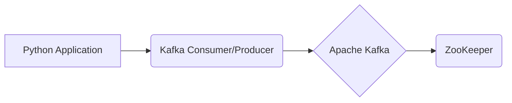

# Connect Kafka to Apache Kafka

Quix helps you integrate Kafka to Apache Kafka using pure Python.

<a class="md-button md-button--primary" href="https://share.hsforms.com/1iW0TmZzKQMChk0lxd_tGiw4yjw2?__hstc=175542013.2303933fbd746c0ac86d9ccbe9bc9100.1728383268831.1729603416735.1729620918855.31&__hssc=175542013.1.1729620918855&__hsfp=2132701734" target="_blank" style="margin-right:.5rem;">Book a demo</a>
 

## Apache Kafka

Apache Kafka is an open-source technology platform that is used for building real-time streaming data pipelines and applications. It is designed to handle large volumes of data in a highly efficient and fault-tolerant manner. Kafka acts as a distributed messaging system that allows for the real-time processing of data streams from multiple sources. It offers high throughput and low latency, making it ideal for use cases such as log aggregation, data integration, and real-time analytics. Additionally, Kafka provides capabilities for storing and replicating data across multiple nodes, ensuring data reliability and consistency. This makes it a powerful tool for organizations looking to harness the power of real-time data processing and analytics.

## Integrations

Quix is a good fit for integrating with Apache Kafka because it offers a streamlined development and deployment process for real-time data pipelines. The platform provides integrated online code editors and CI/CD tools, making it easy to create and deploy pipelines. This aligns well with Kafka's scalability and real-time processing capabilities.

Additionally, Quix's support for enhanced collaboration, real-time monitoring, and flexible scaling aligns with the requirements of working with Kafka. The platform allows for efficient collaboration with organization and permission management, real-time monitoring of pipeline performance, and easy scaling of resources.

Quix also provides support for Kafka integration, allowing users to work with both Quix-hosted and third-party Kafka solutions. This integration simplifies the process of working with Kafka within the Quix platform, enhancing the overall data processing workflow.

Furthermore, Quix Streams, a cloud-native library for processing data in Kafka using Python, complements the integration with Kafka. This library combines Kafka's scalability with a user-friendly Python interface, making it easier for users to work with Kafka data within the Quix platform. The support for serialization formats, time window aggregations, and resilient scaling in Quix Streams further enhances the capabilities of working with Kafka data in Quix.

In conclusion, Quix's comprehensive platform features, integration with Kafka, and support for Python-based data processing make it a good fit for organizations looking to leverage Apache Kafka for real-time data processing.

