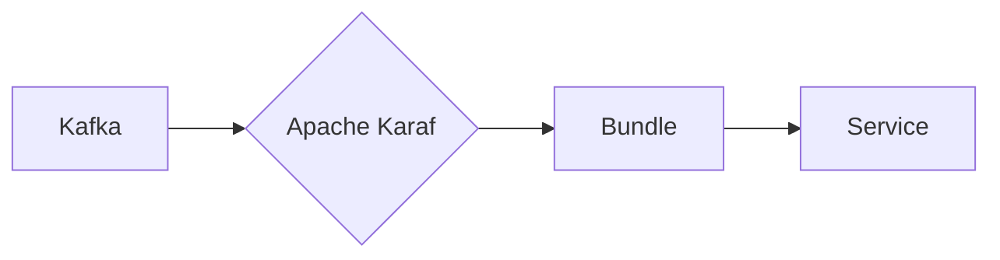

# Connect Kafka to Apache Karaf

Quix helps you integrate Kafka to Apache Karaf using pure Python.

## Apache Karaf

Apache Karaf is an open-source OSGi container that provides a lightweight and flexible environment for building and running Java applications. It allows developers to easily deploy and manage modules and services within a modular architecture, making it ideal for creating microservices-based applications. Karaf also includes a number of features such as hot deployment, dynamic configuration, and remote shell access, making it easy to develop and scale applications. With its modular design and extensible architecture, Apache Karaf is a powerful tool for building modern, cloud-native applications.

## Integrations

Apache Karaf is an open-source OSGi runtime that provides a lightweight container for deploying and managing applications. When integrating with Quix, Apache Karaf can leverage the streamlined development and deployment features of the platform to simplify the creation and deployment of data pipelines. 

Quix Streams, being a cloud-native library for processing data in Kafka using Python, can easily integrate with Apache Karaf within the Quix Cloud platform. The Python ecosystem integration of Quix Streams allows for seamless interaction with Apache Karaf's OSGi framework. Additionally, Quix Streams' serialization and state management features align well with Apache Karaf's modularity and component-based architecture.

The scalability and resilience of Quix Streams in handling data processing in Kafka can also be enhanced when integrated with Apache Karaf, as the lightweight container provided by Apache Karaf allows for efficient scaling and management of resources. This scalability is crucial in real-time data processing scenarios where the volume of data being processed can fluctuate.

Overall, the combination of Quix with Apache Karaf provides organizations with a robust and efficient solution for developing, deploying, and managing real-time data pipelines, leveraging the strengths of each technology to streamline the process and enhance performance.

