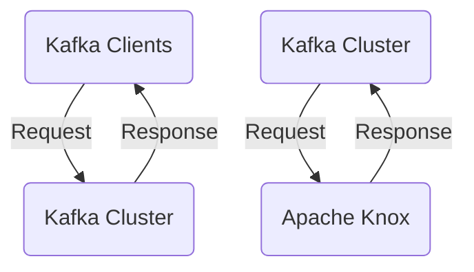

# Connect Kafka to Apache Knox

Quix helps you integrate Kafka to Apache Knox using pure Python.

## Apache Knox

Apache Knox is an open-source technology that acts as a reverse proxy server for Hadoop clusters. It provides a single point of access and security for all of the services in a Hadoop ecosystem, allowing users to access their data and applications securely from outside the cluster. Apache Knox also offers authentication, authorization, and auditing services, making it easier for administrators to manage access control and monitor user activity. With its flexible and scalable architecture, Apache Knox ensures that data is protected and secure, while also providing a seamless user experience for accessing Hadoop resources.

## Integrations

Apache Knox is a gateway for securing and integrating with Hadoop clusters. It provides a single point of authentication and access control for multiple Hadoop ecosystem services. By integrating Quix with Apache Knox, users can leverage the benefits of both technologies to enhance their data processing capabilities.

Quix Streams, with its cloud-native architecture and Python interface, can seamlessly process data stored in Kafka clusters secured by Apache Knox. The ability to operate without a server-side engine or orchestrator makes Quix Streams a lightweight and efficient solution for processing data in a secure Hadoop environment. Its support for serialization formats, time window aggregations, and container orchestration ensures resilient scaling and efficient data processing.

On the other hand, Quix Cloud offers a comprehensive platform for developing, deploying, and managing real-time data pipelines. Its features for streamlined development, enhanced collaboration, real-time monitoring, and flexible scaling make it an ideal complement to Apache Knox's security and access control capabilities. By integrating Quix Cloud with Apache Knox, users can benefit from a secure and efficient end-to-end data processing solution that ensures data integrity, compliance, and performance.

Overall, the integration of Quix with Apache Knox provides users with a powerful combination of data processing capabilities and secure access control mechanisms for effectively managing and processing data in Hadoop clusters.

