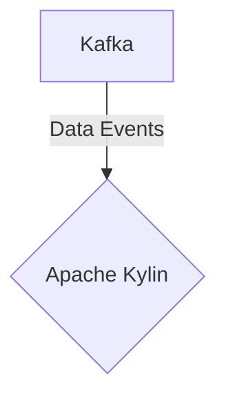

# Connect Kafka to Apache Kylin

Quix helps you integrate Kafka to Apache Kylin using pure Python.

## Apache Kylin

Apache Kylin is an open-source distributed analytics engine built for interactive analytics on massive datasets. It provides high performance and low latency query capabilities on large volumes of data, making it an ideal choice for big data applications. Kylin achieves this by pre-calculating and storing aggregations of data in a cube format, allowing for fast queries across multiple dimensions. Additionally, Kylin supports various data sources such as Hive, HBase, and Apache Parquet, making it a versatile tool for data analysis. Its ability to handle complex queries on large datasets efficiently makes Apache Kylin a powerful technology for organizations looking to leverage their data for deeper insights and faster decision-making.

## Integrations

Apache Kylin is an open-source distributed analytics engine designed for running interactive SQL queries on large datasets. When integrating Apache Kylin with Quix, several benefits can be realized:

1. Streamlined Development and Deployment: Quix Cloud's integrated online code editors and CI/CD tools can simplify the process of developing and deploying Apache Kylin data pipelines. This can help streamline the workflow and save time for developers.

2. Real-Time Monitoring: Quix Cloud's tools for real-time logs, metrics, and data exploration can be beneficial for monitoring the performance of Apache Kylin data pipelines. This real-time monitoring capability can help in identifying and addressing any issues promptly.

3. Flexible Scaling and Management: With Quix Cloud, users can easily scale resources and manage CPU and memory for Apache Kylin data pipelines. This flexibility in scaling and resource management can ensure optimal performance and efficiency.

4. Security and Compliance: Quix Cloud's secure management of secrets and compliance features can help in ensuring the security and compliance of Apache Kylin data pipelines. This can be particularly important when dealing with sensitive data.

5. Data Exploration and Visualization: Quix Cloud's data exploration and visualization capabilities can enhance the user experience when working with Apache Kylin data. Users can query and explore data using waveform and table views, and visualize messages and metrics in real-time.

Overall, the integration of Quix with Apache Kylin can provide a robust platform for developing, deploying, and managing real-time data pipelines that leverage the capabilities of Apache Kylin for interactive SQL queries on large datasets.

