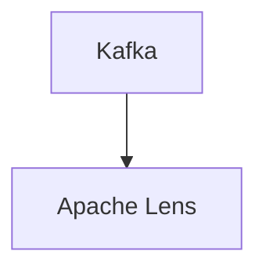

# Connect Kafka to Apache Lens

Quix helps you integrate Kafka to Apache Lens using pure Python.

## Apache Lens

Apache Lens is a powerful technology that allows organizations to easily analyze and visualize data across multiple sources and formats. By providing a unified view of data stored in various databases, data lakes, and data warehouses, Apache Lens enables users to quickly access and make sense of their data. With its intuitive interface and robust query capabilities, Apache Lens streamlines the data analysis process and helps users uncover valuable insights that can inform decision-making and drive business growth. Additionally, Apache Lens offers customizable dashboards and reports, making it easy for users to share their findings with colleagues and stakeholders. Overall, Apache Lens is a versatile and efficient tool that empowers organizations to harness the full potential of their data.

## Integrations

Quix would be a good fit for integrating with Apache Lens because it offers a comprehensive platform for developing, deploying, and managing real-time data pipelines. 

With Quix Cloud, users can streamline development and deployment of data pipelines, enhance collaboration with efficient organization and permission management, and monitor pipeline performance in real-time. The platform also supports flexible scaling and management of resources, ensuring secure management of secrets and compliance with dedicated infrastructure options and SLAs.

Additionally, Quix Streams, a cloud-native library for processing data in Kafka using Python, integrates seamlessly with Python libraries such as Pandas, scikit-learn, TensorFlow, and PyTorch. It supports various serialization formats, stateful operations using RocksDB, time window aggregations, and resilient scaling via container orchestration like Kubernetes.

By integrating Quix with Apache Lens, users can leverage the scalability and user-friendly interfaces provided by these technologies to streamline data processing, enhance collaboration, and ensure efficient monitoring and management of real-time data pipelines.

