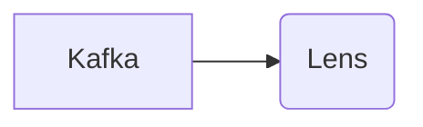

# Connect Kafka to Apache Lens

Quix helps you integrate Kafka to Apache Lens using pure Python.

- __Find out how we can help you integrate!__

    <a class="md-button md-button--primary" href="https://share.hsforms.com/1iW0TmZzKQMChk0lxd_tGiw4yjw2?__hstc=175542013.2303933fbd746c0ac86d9ccbe9bc9100.1728383268831.1729603416735.1729620918855.31&__hssc=175542013.1.1729620918855&__hsfp=2132701734" target="_blank" style="margin:.5rem;">Book a demo</a>

## Apache Lens

Apache Lens is a cutting-edge technology that serves as a unified analytics platform for big data processing. As an open-source project developed by the Apache Software Foundation, Apache Lens allows users to easily access, analyze, and visualize data from various sources such as Hadoop, Apache Spark, and relational databases. Its advanced features enable users to perform complex queries, build interactive dashboards, and gain valuable insights from their data. With support for real-time streaming and historical data analysis, Apache Lens is a powerful tool for organizations looking to make data-driven decisions and optimize their operations. It offers scalability, flexibility, and security, making it an essential tool for businesses operating in the digital age.

## Integrations

Quix is a good fit for integrating with Apache Lens because it offers a comprehensive platform tailored for developing, deploying, and managing real-time data pipelines. The streamlined development and deployment features of Quix make it easy to define and deploy data pipelines using Apache Lens. Additionally, the enhanced collaboration tools in Quix Cloud support efficient teamwork and organization, which is crucial when working with a complex technology like Apache Lens.

Real-time monitoring capabilities in Quix Cloud allow users to closely monitor the performance of their data pipelines, which is essential when integrating with Apache Lens for processing real-time data. The flexible scaling and management options in Quix Cloud make it easy to adjust resources and manage environments, allowing for seamless integration with Apache Lens across various use cases.

The security and compliance features in Quix Cloud ensure that sensitive data processed by Apache Lens is handled securely, while the development tools and data exploration features make it easy to work with Apache Lens and analyze the data being processed. The robust CI/CD processes supported by Quix Cloud also facilitate seamless integration with Apache Lens, ensuring efficient deployment and management of data pipelines.

Furthermore, Quix Streams, a cloud-native library for processing data in Kafka using Python, aligns well with the scalability and user-friendly interface of Apache Lens. The integration of Quix Streams with Apache Lens enables efficient data processing and analysis, leveraging Python's ecosystem integration and serialization capabilities.

In conclusion, Quix's comprehensive platform, real-time monitoring capabilities, collaboration tools, and integration with Kafka through Quix Streams make it a good fit for integrating with Apache Lens to streamline the development, deployment, and management of real-time data pipelines.

