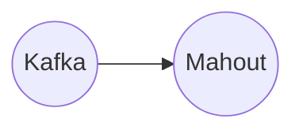

# Connect Kafka to Apache Mahout

Quix helps you integrate Kafka to Apache Mahout using pure Python.

## Apache Mahout

Apache Mahout is an open-source machine learning library that is designed to provide scalable algorithms and tools for building robust machine learning applications. It offers a wide range of algorithms for clustering, classification, and collaborative filtering, making it a popular choice for data scientists and developers working on large-scale, complex data sets. Apache Mahout is built on top of Apache Hadoop, allowing it to easily integrate with other big data technologies and scale to handle massive amounts of data. With its easy-to-use APIs and comprehensive documentation, Apache Mahout has become a go-to solution for organizations looking to implement machine learning capabilities in their applications.

## Integrations

Quix Cloud or Quix Streams is a good fit for integrating with Apache Mahout because both platforms offer key features that complement each other and can enhance the overall data processing workflow.

1. Scalability and Resource Management: Apache Mahout is known for its machine learning algorithms and scalability for big data processing. By integrating with Quix Cloud, users can easily scale resources, manage CPU and memory allocations, and handle multiple environments linked to Git branches. This ensures that the machine learning models developed with Apache Mahout can be deployed and managed efficiently in a cloud environment.

2. Real-Time Monitoring and Logging: Quix Cloud provides tools for real-time monitoring of pipeline performance and critical metrics, which is essential for machine learning model deployment and performance tracking. By integrating with Apache Mahout, users can leverage the monitoring capabilities of Quix Cloud to ensure that their machine learning models are functioning optimally in real-time.

3. Collaboration and Development Tools: Quix Cloud offers features for enhanced collaboration, organization, and permission management, which is crucial for teams working on machine learning projects with Apache Mahout. The platform also includes online code editors, code templates, and connectors for various data sources and sinks, supporting DevContainers for streamlined workflows. This facilitates efficient development and deployment of machine learning models using Apache Mahout within a collaborative environment.

4. Kafka Integration: Quix Cloud supports integration with Kafka, which is commonly used for real-time data processing and streaming. Apache Mahout can benefit from this integration by leveraging Kafka for ingesting and processing data for machine learning model training and inference. Users can easily deploy Apache Mahout in a Kafka-powered environment using Quix Cloud, enabling seamless integration of both technologies for scalable and efficient data processing.

Overall, the features and capabilities of Quix Cloud make it a suitable choice for integrating with Apache Mahout to streamline the development, deployment, and management of machine learning models in real-time data pipelines. The scalability, monitoring, collaboration, and Kafka integration offered by Quix Cloud complement the machine learning capabilities of Apache Mahout, making it a powerful combination for data processing and analytics tasks.

