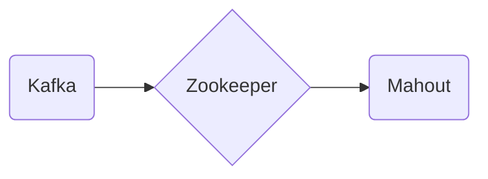

# Connect Kafka to Apache Mahout

Quix helps you integrate Kafka to Apache Mahout using pure Python.

- __Find out how we can help you integrate!__

    <a class="md-button md-button--primary" href="https://share.hsforms.com/1iW0TmZzKQMChk0lxd_tGiw4yjw2?__hstc=175542013.2303933fbd746c0ac86d9ccbe9bc9100.1728383268831.1729603416735.1729620918855.31&__hssc=175542013.1.1729620918855&__hsfp=2132701734" target="_blank" style="margin:.5rem;">Book a demo</a>

## Apache Mahout

Apache Mahout is an open-source machine learning library that is designed to help users build scalable machine learning algorithms. This technology is built on top of the Apache Hadoop computational framework and aims to provide an easy way for developers to create and deploy machine learning models. With Mahout, users can implement a wide range of machine learning tasks, such as clustering, collaborative filtering, and classification, with ease. The technology also offers various algorithms and tools to help users analyze and interpret large datasets, making it a valuable tool for data scientists and developers looking to leverage machine learning techniques in their projects.

## Integrations

Quix is a good fit for integrating with Apache Mahout because of its comprehensive platform designed for developing, deploying, and managing real-time data pipelines. With features like streamlined development and deployment, enhanced collaboration, real-time monitoring, flexible scaling and management, and security and compliance measures, Quix provides the necessary infrastructure for integrating with technologies like Apache Mahout.

Apache Mahout, a scalable machine learning library that offers various clustering, classification, and collaborative filtering algorithms, can benefit from Quix's development tools, data exploration and visualization capabilities, CI/CD processes, and Kafka integration. Quix Streams, a cloud-native library for processing data in Kafka using Python, can also complement Apache Mahout's functionalities by providing a user-friendly Python interface, serialization and state management support, time window aggregations, and resilient scaling capabilities.

Overall, the seamless integration between Quix and Apache Mahout can enhance the efficiency and effectiveness of machine learning workflows, enabling organizations to build and deploy robust data pipelines for advanced analytics and decision-making processes.

