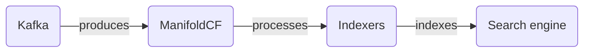

# Connect Kafka to Apache ManifoldCF

Quix helps you integrate Kafka to Apache ManifoldCF using pure Python.

## Apache ManifoldCF

Apache ManifoldCF is an open-source technology designed to easily and efficiently connect and synchronize content between various systems and repositories. It serves as a flexible and scalable solution for managing large amounts of data across different platforms, ensuring that information remains consistent and up-to-date. With its powerful integration capabilities and customizable connectors, Apache ManifoldCF allows organizations to streamline their content management processes and improve overall productivity. Additionally, the technology offers extensive security features, allowing users to securely transfer data between systems while maintaining data integrity. Overall, Apache ManifoldCF is a valuable tool for businesses looking to enhance their content management capabilities and improve collaboration across multiple platforms.

## Integrations

Apache ManifoldCF is an open-source software framework for connecting systems to ingest and index content in a scalable and resilient manner. Integrating Quix with Apache ManifoldCF can provide numerous benefits for managing data ingestion and processing pipelines.

1. Streamlined Development and Deployment: Quix Cloud offers integrated online code editors and CI/CD tools, which can simplify the creation and deployment of data pipelines within Apache ManifoldCF. The ability to define pipelines and environment variables as code using YAML synchronization can streamline the development process.

2. Real-Time Monitoring: Quix Cloud provides tools for real-time logs, metrics, and data exploration, which can be useful for monitoring the performance of data ingestion and processing tasks managed by Apache ManifoldCF. This real-time monitoring capability can help identify and troubleshoot issues quickly.

3. Flexible Scaling and Management: Quix Cloud allows users to easily scale resources, manage CPU and memory, and handle multiple environments linked to Git branches. This flexibility can be beneficial for Apache ManifoldCF deployments that require dynamic scaling based on workload demands.

4. Security and Compliance: Quix Cloud ensures secure management of secrets and compliance with dedicated infrastructure options and SLAs, which is essential for maintaining data security and regulatory compliance when integrating with Apache ManifoldCF.

5. Development Tools: Quix Cloud includes online code editors, code templates, and connectors for various data sources and sinks, supporting DevContainers for enhanced workflows. These development tools can enhance the productivity of developers working on Apache ManifoldCF pipelines.

6. Data Exploration and Visualization: Quix Cloud offers features for querying and exploring data, as well as visualizing messages and metrics in real-time. This data exploration and visualization capability can provide insights into the performance and output of Apache ManifoldCF pipelines.

Overall, the capabilities provided by Quix align well with the requirements of managing data ingestion and processing pipelines within Apache ManifoldCF. The streamlined development, real-time monitoring, flexible scaling, security and compliance features, as well as development tools and data exploration capabilities, make Quix a good fit for integrating with Apache ManifoldCF to enhance data pipeline management and efficiency.

