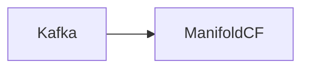

# Connect Kafka to Apache ManifoldCF

Quix helps you integrate Kafka to Apache ManifoldCF using pure Python.

- __Find out how we can help you integrate!__

    <a class="md-button md-button--primary" href="https://share.hsforms.com/1iW0TmZzKQMChk0lxd_tGiw4yjw2?__hstc=175542013.2303933fbd746c0ac86d9ccbe9bc9100.1728383268831.1729603416735.1729620918855.31&__hssc=175542013.1.1729620918855&__hsfp=2132701734" target="_blank" style="margin:.5rem;">Book a demo</a>

## Apache ManifoldCF

Apache ManifoldCF is an open-source software technology designed to help organizations effectively manage and connect their various content repositories. By providing a modular framework for content integration, Apache ManifoldCF allows users to easily extract, transform, and load data from a wide range of sources, including databases, cloud services, and document management systems. This technology ensures that content is accurately synchronized and distributed across different platforms, making it easier for businesses to access and share critical information. With its flexibility and scalability, Apache ManifoldCF is an essential tool for streamlining content workflows and improving productivity within organizations.

## Integrations

Quix is a good fit for integrating with Apache ManifoldCF because it offers a comprehensive platform for developing, deploying, and managing real-time data pipelines. Quix's features such as streamlined development and deployment, enhanced collaboration, real-time monitoring and scaling capabilities, security and compliance, development tools, data exploration and visualization, robust CI/CD processes, and Kafka integration align well with the functionality and requirements of Apache ManifoldCF.

For instance, Quix's streamlined development and deployment tools such as integrated online code editors and CI/CD tools can simplify the process of creating and deploying data pipelines within Apache ManifoldCF. Its enhanced collaboration features can improve project visibility and control within ManifoldCF, while its real-time monitoring capabilities can help users track pipeline performance and critical metrics.

Additionally, Quix's support for flexible scaling and management, security and compliance features, development tools, and Kafka integration can complement and enhance the functionality of Apache ManifoldCF. The platform's support for dedicated infrastructure options, DevContainers for enhanced workflows, data exploration and visualization tools, and integration with Git providers can also benefit users who are integrating Quix with Apache ManifoldCF.

Moreover, Quix Streams, a cloud-native library for processing data in Kafka using Python, can further enhance the integration with Apache ManifoldCF by offering benefits such as Python ecosystem integration, serialization and state management support, time window aggregations, resilient scaling via container orchestration, and local and Jupyter Notebook support. Overall, the compatibility of Quix's features with the requirements of Apache ManifoldCF makes it a good fit for integration with this technology.

