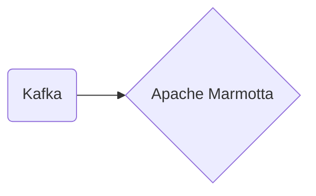

# Connect Kafka to Apache Marmotta

Quix helps you integrate Kafka to Apache Marmotta using pure Python.

## Apache Marmotta

Apache Marmotta is an open-source platform that provides support for Linked Data technologies. It is designed to store, manage, and query Linked Data in an efficient and effective way. Apache Marmotta enables users to integrate diverse data sources and build semantic web applications. The platform includes a triple store for storing RDF data, a SPARQL endpoint for querying data, and tools for managing and visualizing Linked Data. Apache Marmotta is built using Java and is highly extensible, allowing users to customize it to fit their specific needs. Overall, Apache Marmotta is a powerful tool for working with Linked Data and building semantic web applications.

## Integrations

Apache Marmotta is a platform for linked data management that can benefit from integration with both Quix Streams and Quix Cloud. Here's why:

1. Streamlined Development and Deployment: Quix Cloud's integrated online code editors and CI/CD tools can make it easier to develop and deploy data pipelines in Apache Marmotta. This can help streamline the development process and make it more efficient.

2. Enhanced Collaboration: With Quix Cloud's support for organization and permission management, teams working on Apache Marmotta can collaborate more effectively and have greater visibility and control over their projects.

3. Real-Time Monitoring: Quix Cloud's tools for real-time logs, metrics, and data exploration can be valuable for monitoring the performance of data pipelines in Apache Marmotta. This can help identify issues quickly and ensure that the system is running smoothly.

4. Flexible Scaling and Management: Quix Cloud's capabilities for scaling resources and managing multiple environments can be beneficial for Apache Marmotta users who need to handle large volumes of data. This can help ensure that the platform can handle growing workloads and maintain performance.

5. Security and Compliance: Quix Cloud's secure management of secrets and compliance options can be important for Apache Marmotta users who are working with sensitive data. This can help ensure that data is protected and that regulatory requirements are met. 

Overall, the features of Quix Streams and Quix Cloud make them good fits for integrating with Apache Marmotta, as they can help enhance development, collaboration, monitoring, scaling, and security for users working with linked data management.

