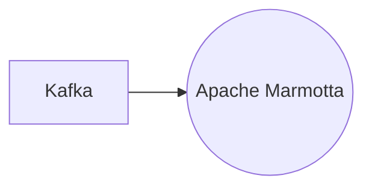

# Connect Kafka to Apache Marmotta

Quix helps you integrate Kafka to Apache Marmotta using pure Python.

<a class="md-button md-button--primary" href="https://share.hsforms.com/1iW0TmZzKQMChk0lxd_tGiw4yjw2?__hstc=175542013.2303933fbd746c0ac86d9ccbe9bc9100.1728383268831.1729603416735.1729620918855.31&__hssc=175542013.1.1729620918855&__hsfp=2132701734" target="_blank" style="margin-right:.5rem;">Book a demo</a>
 

## Apache Marmotta

Apache Marmotta is an open-source platform that provides a linked data database and integrates various data sources on the web. It allows users to store and query interconnected data using semantic web technologies. Apache Marmotta supports the RDF (Resource Description Framework) data model and provides APIs for managing and querying linked data. It also includes a web-based user interface for exploring the linked data repository. Apache Marmotta is a powerful tool for building linked data applications and facilitating data integration and interoperability on the web.

## Integrations

Quix is a good fit for integrating with Apache Marmotta because it offers a comprehensive platform for developing, deploying, and managing real-time data pipelines, which aligns well with Apache Marmotta's capabilities as a linked data platform.

Firstly, Quix provides streamlined development and deployment features such as integrated online code editors and CI/CD tools, which can simplify the process of integrating with Apache Marmotta and deploying data pipelines seamlessly.

Quix also enhances collaboration through organization and permission management, increasing project visibility and control. This can facilitate teamwork when working on integrating Apache Marmotta into existing systems or building new applications.

Furthermore, the real-time monitoring and scaling capabilities of Quix Cloud align with Apache Marmotta's need for monitoring pipeline performance and managing resources efficiently. This can ensure that the integrated system performs optimally and can handle fluctuations in data processing requirements.

Additionally, Quix offers robust CI/CD processes with integration with Git providers like GitHub, making it easier to manage and track changes when integrating with Apache Marmotta. This ensures a seamless development and deployment process for the integration project.

Lastly, Quix Streams, a cloud-native library for processing data in Kafka using Python, can be leveraged to work with Apache Marmotta's data processing requirements. The library's scalability, Python ecosystem integration, and serialization capabilities make it a suitable choice for integrating Apache Marmotta with Kafka data streams efficiently.

In conclusion, Quix's comprehensive features and compatibility with Apache Marmotta's requirements make it a good fit for integrating with the technology and enhancing the overall data processing capabilities of the system.

