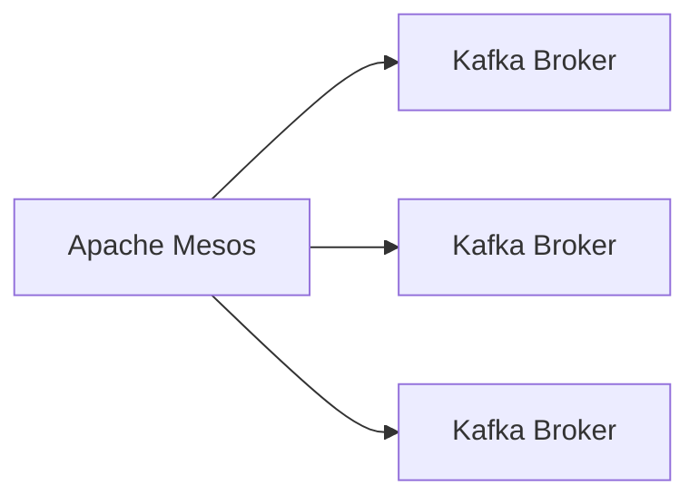

# Connect Kafka to Apache Mesos

Quix helps you integrate Kafka to Apache Mesos using pure Python.

## Apache Mesos

Apache Mesos is an open-source technology that provides efficient resource management and scheduling for distributed computing environments. It allows organizations to easily manage and scale their application workloads across multiple machines or clusters. Mesos acts as a layer of abstraction between applications and the underlying infrastructure, enabling seamless deployment and execution of tasks without worrying about resource allocation or scheduling. With its sophisticated resource sharing and isolation mechanisms, Mesos maximizes resource utilization and minimizes downtime. Its flexible architecture also allows for easy integration with popular container technologies like Docker, making it a versatile solution for managing modern cloud-native applications.

## Integrations

Apache Mesos is a technology that provides efficient resource management and scheduling for distributed applications. It allows for the dynamic sharing of resources across clusters, enabling better utilization and scalability of infrastructure.

Quix is a good fit for integrating with Apache Mesos because it complements Mesos' capabilities by providing a comprehensive platform for developing, deploying, and managing real-time data pipelines. The key features of Quix Cloud, such as streamlined development and deployment, real-time monitoring, flexible scaling, and enhanced collaboration, align well with the resource management and scheduling capabilities of Apache Mesos.

By integrating Quix with Apache Mesos, organizations can benefit from a seamless and efficient process of building and managing data pipelines, while also leveraging Mesos' resource optimization and scalability features. This integration can help organizations achieve better resource utilization, improved performance, and enhanced scalability for their data processing workflows.

