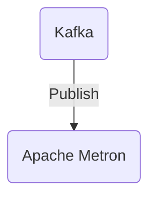

# Connect Kafka to Apache Metron

Quix helps you integrate Kafka to Apache Metron using pure Python.

## Apache Metron

Apache Metron is a comprehensive big data cyber security platform that helps organizations detect and respond to cyber threats in real time. It integrates various open-source technologies such as Apache Kafka, Apache Hadoop, and Apache Storm to collect, stream, and analyze large volumes of data from multiple sources. This allows organizations to monitor their networks, identify malicious activity, and take immediate action to protect their systems. Apache Metron also provides advanced features such as machine learning algorithms, threat intelligence integration, and customizable dashboards for visualizing security data. Overall, Apache Metron is a powerful tool for improving an organization's cyber security posture and defending against cyber threats.

## Integrations

Apache Metron is an open-source solution designed for real-time security monitoring and analysis of large volumes of data. By integrating Quix with Apache Metron, organizations can leverage the capabilities of both platforms to enhance their security monitoring and threat detection processes.

Quix Streams, with its ability to process data in Kafka using Python, can provide seamless integration with Apache Metron's data ingestion and processing capabilities. The library's support for serialization, state management, time window aggregations, and resilient scaling align well with the requirements of a sophisticated security monitoring system like Apache Metron.

Additionally, Quix Cloud's features such as streamlined development and deployment, real-time monitoring, and flexible scaling can further enhance the operational efficiency of Apache Metron deployments. The platform's development tools, data exploration, and visualization capabilities can enable security analysts to easily build and analyze complex data pipelines within Apache Metron.

Overall, the combination of Quix with Apache Metron offers a powerful solution for organizations looking to strengthen their real-time security monitoring and threat detection capabilities. The seamless integration and complementary features of these platforms make them a good fit for organizations seeking an efficient and scalable security monitoring solution.

