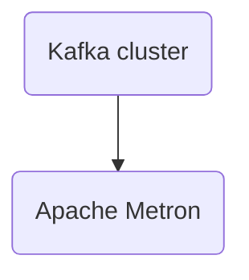

# Connect Kafka to Apache Metron

Quix helps you integrate Kafka to Apache Metron using pure Python.

<a class="md-button md-button--primary" href="https://share.hsforms.com/1iW0TmZzKQMChk0lxd_tGiw4yjw2?__hstc=175542013.2303933fbd746c0ac86d9ccbe9bc9100.1728383268831.1729603416735.1729620918855.31&__hssc=175542013.1.1729620918855&__hsfp=2132701734" target="_blank" style="margin-right:.5rem;">Book a demo</a>
 

## Apache Metron

Apache Metron is an open-source, extensible big data cybersecurity platform that leverages the power of Apache Hadoop and Apache Storm to provide real-time security monitoring and analysis capabilities. Built to help organizations detect and respond to threats quickly and efficiently, Metron ingests and enriches diverse data sources, such as network telemetry, endpoint logs, and threat intelligence feeds, to provide a comprehensive view of the security landscape. With its customizable data processing pipeline and machine learning algorithms, Metron is able to identify suspicious patterns and anomalies, flagging potential security incidents for further investigation. Its user-friendly interface and integration with popular security tools make it a valuable asset for any organization looking to strengthen its cybersecurity posture.

## Integrations

Quix is a good fit for integrating with Apache Metron because it offers a comprehensive platform for developing, deploying, and managing real-time data pipelines, which aligns well with the goals of Apache Metron. 

The streamlined development and deployment features of Quix Cloud, such as integrated online code editors and CI/CD tools, make it easy to create and deploy data pipelines, which can greatly benefit the integration process with Apache Metron. The enhanced collaboration capabilities of Quix Cloud, including organization and permission management, can also facilitate efficient teamwork when working on Apache Metron projects. 

Real-time monitoring and scaling capabilities provided by Quix Cloud are essential for managing data pipelines in a dynamic environment like Apache Metron, ensuring optimal performance and resource allocation. The platform's security and compliance features further enhance the integration process by ensuring the secure management of data and compliance with relevant regulations. 

Moreover, the development tools and data exploration capabilities of Quix Cloud can help streamline the integration process with Apache Metron, enabling users to easily query and visualize data and troubleshoot any issues that may arise. Quix Streams, with its cloud-native approach to processing data in Kafka using Python, also complements Apache Metron's data processing needs, offering benefits such as seamless integration with the Python ecosystem and support for time window aggregations and resilient scaling. 

Overall, Quix's robust features and flexibility make it a well-suited platform for integrating with Apache Metron, offering the tools and capabilities needed to effectively manage and process real-time data streams.

