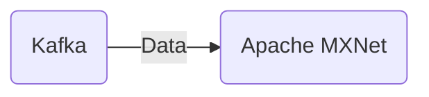

# Connect Kafka to Apache MXNet

Quix helps you integrate Kafka to Apache MXNet using pure Python.

## Apache MXNet

Apache MXNet is an open-source deep learning framework designed for efficient and scalable machine learning tasks. It is known for its flexibility, allowing users to build and train neural networks across multiple GPUs and CPUs. MXNet's advanced features include automatic differentiation, dynamic computational graphs, and distributed training capabilities. By leveraging cutting-edge technology, MXNet enables developers to create powerful and accurate deep learning models for a wide range of applications, including image recognition, natural language processing, and reinforcement learning. With its comprehensive set of tools and APIs, Apache MXNet is a popular choice for researchers and industry professionals looking to push the boundaries of artificial intelligence.

## Integrations

Quix is a good fit for integrating with Apache MXNet because both platforms are designed to facilitate real-time data processing and deployment. Quix Cloud offers features such as streamlined development and deployment, enhanced collaboration, real-time monitoring, and flexible scaling, which align well with Apache MXNet's capabilities for deep learning and machine learning tasks.

Apache MXNet is a powerful deep learning framework that allows for building and training models at scale. By integrating Apache MXNet with Quix, developers can leverage the platform's streamlined development and deployment tools to build and deploy real-time data pipelines for training and inference with Apache MXNet models.

Furthermore, Quix Cloud's support for CI/CD processes and collaboration features can enhance the workflow for developing, deploying, and managing Apache MXNet models. The platform's real-time monitoring capabilities can also provide valuable insights into model performance and help optimize resource usage for training and inference tasks.

In addition, Quix Streams' cloud-native library for processing data in Kafka using Python can complement Apache MXNet's capabilities by providing a user-friendly interface for data processing tasks. The serialization and state management features of Quix Streams can facilitate seamless integration with Apache MXNet models, while the platform's support for time window aggregations and resilient scaling can help optimize data processing workflows.

Overall, by integrating Quix with Apache MXNet, developers can leverage the strengths of both platforms to build scalable, efficient, and reliable real-time data pipelines for deep learning and machine learning applications.

