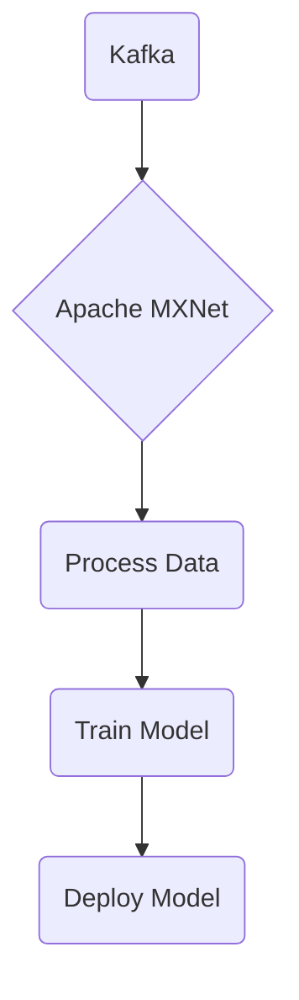

# Connect Kafka to Apache MXNet

Quix helps you integrate Kafka to Apache MXNet using pure Python.

- __Find out how we can help you integrate!__

    <a class="md-button md-button--primary" href="https://share.hsforms.com/1iW0TmZzKQMChk0lxd_tGiw4yjw2?__hstc=175542013.2303933fbd746c0ac86d9ccbe9bc9100.1728383268831.1729603416735.1729620918855.31&__hssc=175542013.1.1729620918855&__hsfp=2132701734" target="_blank" style="margin:.5rem;">Book a demo</a>

## Apache MXNet

Apache MXNet is an open-source deep learning framework that is highly flexible and efficient. It is designed for training and deploying deep neural networks, with support for a wide range of programming languages, including Python, Scala, and Julia. MXNet offers high performance on both CPUs and GPUs, making it ideal for training models on a variety of hardware platforms. It also provides a wealth of advanced features, such as automatic differentiation, distributed training, and support for multiple data types. Overall, Apache MXNet is a powerful tool for researchers and developers looking to build cutting-edge machine learning models.

## Integrations

Quix is a good fit for integrating with Apache MXNet due to its comprehensive platform designed for developing, deploying, and managing real-time data pipelines. Apache MXNet is an open-source deep learning framework known for its scalability and flexibility, making it a popular choice for companies working with large-scale machine learning models. 

Quix's streamlined development and deployment features, such as integrated online code editors and CI/CD tools, can simplify the process of building and deploying machine learning models utilizing Apache MXNet. Additionally, Quix's support for collaboration and organization management can enhance team productivity when working on machine learning projects.

Moreover, Quix's real-time monitoring capabilities can be beneficial for monitoring the performance of machine learning models trained using Apache MXNet. Users can leverage Quix's tools for real-time logs, metrics, and data exploration to monitor critical metrics and make informed decisions on model optimization and scalability.

Quix's flexible scaling and management options can also be advantageous when working with Apache MXNet, as users can easily scale resources, manage CPU and memory, and handle multiple environments for testing and deployment. This can help in optimizing the performance of machine learning models trained on Apache MXNet and ensure efficient resource utilization.

Overall, the features offered by Quix, such as streamlined development, enhanced collaboration, real-time monitoring, and flexible scaling, make it a suitable platform for integrating with Apache MXNet and developing machine learning pipelines effectively. By utilizing Quix's capabilities, users can benefit from a seamless integration with Apache MXNet and streamline the development and deployment of machine learning models.

