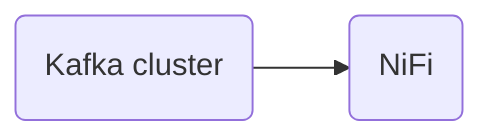

# Connect Kafka to Apache NiFi

Quix helps you integrate Kafka to Apache NiFi using pure Python.

## Apache NiFi

Apache NiFi is an open-source data integration platform that enables users to easily automate the movement of data between various systems. Developed by the Apache Software Foundation, NiFi provides a graphical user interface that allows users to create and customize data flows without writing any code. With NiFi, users can efficiently collect, route, and transform data in real-time, making it an ideal tool for streaming data processing and data ingestion tasks. NiFi also offers advanced features such as data provenance, security controls, and extensibility through the use of custom processors and extensions. Overall, Apache NiFi is a powerful and flexible technology that simplifies the process of managing data flows in complex, distributed systems.

## Integrations

Apache NiFi is a powerful technology for automating the flow of data between systems. When integrating with Quix Streams or Quix Cloud, there are several reasons why they are a good fit for enhancing the capabilities of Apache NiFi:

1. Enhanced Collaboration: Quix Cloud's support for organization and permission management can enhance collaboration between teams working on Apache NiFi data pipelines. This can improve project visibility and control, making it easier for multiple teams to work together on complex data flows.

2. Real-Time Monitoring: Quix Cloud's tools for real-time logs, metrics, and data exploration can provide valuable insights into the performance of data pipelines built with Apache NiFi. This real-time monitoring can help teams identify bottlenecks, troubleshoot issues, and optimize the performance of their data flows.

3. Flexible Scaling and Management: Quix Cloud's ability to easily scale resources and manage CPU and memory can complement Apache NiFi's scalability features. This can help organizations handle large volumes of data more effectively and efficiently, ensuring that their data pipelines can meet the demands of their business needs.

4. Security and Compliance: Quix Cloud's secure management of secrets and compliance features can help organizations ensure that their data pipelines built with Apache NiFi meet security and regulatory requirements. This can be particularly important for organizations handling sensitive data or operating in regulated industries.

5. Development Tools: Quix Cloud's online code editors, code templates, and connectors for various data sources and sinks can streamline the development process for Apache NiFi data pipelines. This can help teams build data pipelines more quickly and efficiently, freeing up time for more advanced data processing and analysis tasks.

Overall, the integration of Quix Streams or Quix Cloud with Apache NiFi can provide organizations with a comprehensive platform for developing, deploying, and managing real-time data pipelines. By leveraging the unique features of each technology, organizations can enhance the efficiency, scalability, and security of their data processing workflows.

