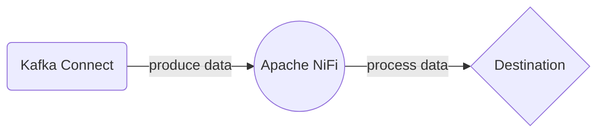

# Connect Kafka to Apache Nifi

Quix helps you integrate Kafka to Apache Nifi using pure Python.

<a class="md-button md-button--primary" href="https://share.hsforms.com/1iW0TmZzKQMChk0lxd_tGiw4yjw2?__hstc=175542013.2303933fbd746c0ac86d9ccbe9bc9100.1728383268831.1729603416735.1729620918855.31&__hssc=175542013.1.1729620918855&__hsfp=2132701734" target="_blank" style="margin-right:.5rem;">Book a demo</a>
 

## Apache Nifi

Apache Nifi is an open-source data integration tool that allows users to easily automate the flow of data between systems. It is designed to be scalable, flexible, and easy to use, making it ideal for organizations looking to streamline their data processing pipelines. Apache Nifi offers a visual interface that allows users to create and manage data flows using a drag-and-drop approach, making it simple to design and modify workflows. Additionally, Apache Nifi provides a wide range of processors that can be used to interact with various data sources, perform transformations, and route data to different destinations. Overall, Apache Nifi is a powerful tool for managing data flows and ensuring that information is moved efficiently through an organization's systems.

## Integrations

Quix is a good fit for integrating with Apache Nifi because it complements the capabilities of Apache Nifi in multiple ways.

1. Streamlined Development and Deployment: Quix Cloud's integrated online code editors and CI/CD tools can simplify the creation and deployment of data pipelines in Apache Nifi. With YAML synchronization for defining pipelines as code, developers can easily manage their pipelines and environment variables within the Quix platform.

2. Enhanced Collaboration: Quix Cloud's organization and permission management features can increase collaboration efficiency when working with Apache Nifi. This allows team members to have better visibility and control over the project, leading to improved productivity and smoother teamwork.

3. Real-Time Monitoring: With tools for real-time logs, metrics, and data exploration, Quix Cloud can provide significant value to Apache Nifi users in monitoring pipeline performance and critical metrics. This real-time monitoring capability can help users quickly identify and address any issues in their data pipelines.

4. Flexible Scaling and Management: Quix Cloud's ability to easily scale resources and manage CPU and memory can be beneficial for Apache Nifi users who need to handle multiple environments and scale their pipelines based on workload. Additionally, Quix's integration with Git providers can streamline CI/CD processes for Apache Nifi pipelines.

5. Kafka Integration: Quix Cloud's support for Kafka integration aligns well with Apache Nifi's capabilities, as Apache Nifi is commonly used for ingesting and processing data from Kafka streams. By leveraging Quix Streams, a cloud-native library for processing data in Kafka using Python, users can harness the scalability of Kafka while enjoying the ease of use and flexibility of Python.

In summary, Quix's comprehensive platform features, such as streamlined development and deployment, enhanced collaboration, real-time monitoring, flexible scaling and management, and Kafka integration, make it a suitable choice for integrating with Apache Nifi. Both platforms complement each other's strengths and can work together to build robust and efficient data pipelines.

