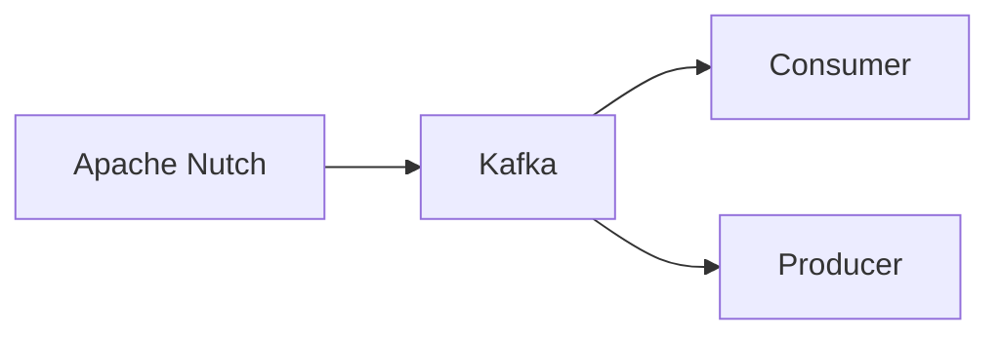

# Connect Kafka to Apache Nutch

Quix helps you integrate Kafka to Apache Nutch using pure Python.

## Apache Nutch

Apache Nutch is an open source web crawling and search engine software program that is used primarily for web scraping and data mining purposes. Created by Apache Software Foundation, Apache Nutch is designed to fetch and store websites in a highly scalable and efficient manner, making it an invaluable tool for organizations looking to collect and analyze large amounts of data from the web. With its flexible architecture and robust features, Apache Nutch is widely used for a variety of applications, including search engine development, content aggregation, and competitive intelligence gathering. Its modular design allows for easy customization and integration with other software tools, making it a versatile and powerful solution for extracting valuable insights from the vast expanse of the internet.

## Integrations

Quix is a good fit for integrating with Apache Nutch because of its real-time data processing capabilities and seamless integration with Apache Kafka. Quix Streams, as a cloud-native library, provides a user-friendly Python interface which is ideal for developers working with Apache Nutch. 

The key benefits of Quix Streams, such as no JVM required, Python ecosystem integration, serialization and state management support, time window aggregations, and resilient scaling, align well with the needs of developers working with Apache Nutch. 

Furthermore, Quix Cloud's features like streamlined development and deployment, enhanced collaboration, real-time monitoring, and flexible scaling and management are also highly beneficial for developers working with Apache Nutch. The platform's Kafka integration and dedicated infrastructure options provide additional flexibility and control for Apache Nutch users.

Overall, Quix can enhance the development, deployment, monitoring, and scaling processes of Apache Nutch data pipelines, making it a suitable choice for integration with this technology.

