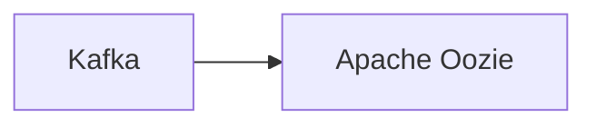

# Connect Kafka to Apache Oozie

Quix helps you integrate Kafka to Apache Oozie using pure Python.

## Apache Oozie

Apache Oozie is an open-source workflow engine that is used to schedule, manage, and execute Hadoop jobs. It enables users to define dependencies between tasks and execute them in a specific order, making it easier to manage complex data processing workflows. Oozie supports workflows that include a variety of Hadoop ecosystem tools such as MapReduce, Hive, Pig, and Sqoop. It provides a web-based interface for creating and monitoring workflows, as well as a command line interface for more advanced users. With Apache Oozie, organizations can streamline their data processing workflows and improve the efficiency of their big data operations.

## Integrations

Apache Oozie is a workflow scheduler system that is primarily used to manage Hadoop jobs. It allows users to define, schedule, and run complex data workflows. When integrating with Quix, there are several reasons why it would be a good fit:

1. Streamlined Development and Deployment: Quix Cloud's integrated online code editors and CI/CD tools simplify the creation and deployment of data pipelines, which align well with the workflow management capabilities of Apache Oozie.

2. Real-Time Monitoring: Quix Cloud provides tools for real-time logs, metrics, and data exploration, allowing users to monitor pipeline performance. This complements Apache Oozie's ability to track and manage workflow progress and performance.

3. Flexible Scaling and Management: Quix Cloud allows users to easily scale resources and manage environments, which can be beneficial when working with Apache Oozie for handling large-scale data workflows.

4. Security and Compliance: Quix Cloud ensures secure management of secrets and compliance, which is essential when integrating with Apache Oozie to handle sensitive data.

5. Development Tools: Quix Cloud includes online code editors and connectors for various data sources, supporting DevContainers for enhanced workflows, making it easier to develop and manage data pipelines in conjunction with Apache Oozie.

6. Kafka Integration: Quix Cloud supports third-party Kafka solutions, which can be leveraged when integrating with Apache Oozie to process data from Kafka using Quix Streams.

Overall, the combination of Quix with Apache Oozie would provide a comprehensive solution for managing and processing data workflows efficiently, with enhanced collaboration, monitoring, and scaling capabilities.

