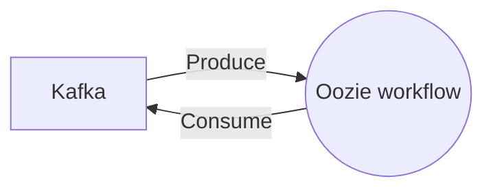

# Connect Kafka to Apache Oozie

Quix helps you integrate Kafka to Apache Oozie using pure Python.

<a class="md-button md-button--primary" href="https://share.hsforms.com/1iW0TmZzKQMChk0lxd_tGiw4yjw2?__hstc=175542013.2303933fbd746c0ac86d9ccbe9bc9100.1728383268831.1729603416735.1729620918855.31&__hssc=175542013.1.1729620918855&__hsfp=2132701734" target="_blank" style="margin-right:.5rem;">Book a demo</a>
 

## Apache Oozie

Apache Oozie is a workflow scheduler system designed for managing Hadoop jobs. It allows users to define and execute workflows with a series of dependent actions in a coordinated and reliable manner. Oozie supports different types of workflows, such as MapReduce, Pig, Hive, and Sqoop jobs. It provides a centralized platform for coordinating job scheduling, monitoring, and error handling, making it easier for users to manage complex data processing tasks. With its web-based user interface and REST API, Apache Oozie offers a seamless and efficient way to automate and control the execution of Hadoop jobs in distributed computing environments.

## Integrations

Quix is a good fit for integrating with Apache Oozie because of its comprehensive platform designed for developing, deploying, and managing real-time data pipelines. 

1. Streamlined Development and Deployment: Quix's integrated online code editors and CI/CD tools simplify the creation and deployment of data pipelines, making it easier to integrate with Apache Oozie's workflow scheduling capabilities.

2. Enhanced Collaboration: Quix supports efficient collaboration with organization and permission management, increasing project visibility and control, which can align well with Apache Oozie's workflow coordination and management features.

3. Real-Time Monitoring: Quix Cloud provides tools for real-time logs, metrics, and data exploration, allowing users to monitor pipeline performance, which can complement Apache Oozie's monitoring and alerting capabilities.

4. Flexible Scaling and Management: Quix users can easily scale resources and manage CPU and memory, which can work well with Apache Oozie's resource management and job scheduling capabilities.

5. Security and Compliance: Quix ensures secure management of secrets and compliance with dedicated infrastructure options, which can align with Apache Oozie's security features and compliance requirements.

6. Development Tools: Quix's online code editors, code templates, and connectors for various data sources and sinks can enhance workflows when integrating with Apache Oozie.

7. Data Exploration and Visualization: Quix's ability to query and explore data and visualize messages and metrics in real-time can complement Apache Oozie's data processing and workflow visualization capabilities.

Overall, Quix's features such as streamlined development and deployment, collaboration tools, real-time monitoring, flexible scaling, security and compliance measures, and robust development tools make it a good fit for integrating with Apache Oozie for effectively managing and orchestrating real-time data pipelines.

