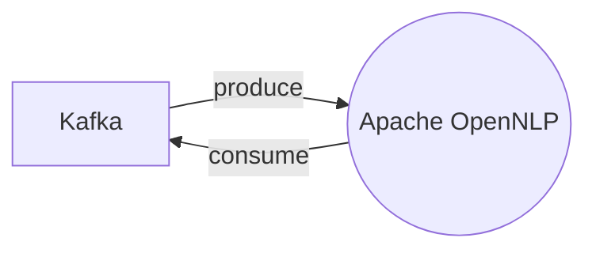

# Connect Kafka to Apache OpenNLP

Quix helps you integrate Kafka to Apache OpenNLP using pure Python.

## Apache OpenNLP

Apache OpenNLP is an open-source technology that provides a suite of natural language processing tools for tasks such as tokenization, sentence segmentation, part-of-speech tagging, named entity extraction, and more. Utilizing machine learning algorithms, Apache OpenNLP allows developers to build applications that can analyze and understand natural language text. With its flexible architecture, Apache OpenNLP can be easily integrated into various applications and provides support for multiple languages. This technology is widely used in industries such as healthcare, finance, and e-commerce to process and extract valuable information from unstructured text data.

## Integrations

Quix is a good fit for integrating with Apache OpenNLP because of its comprehensive platform capabilities that support real-time data processing and management. The integration with Apache OpenNLP, a natural language processing technology, can be optimized using the features of Quix:

1. Streamlined Development and Deployment: Quix offers integrated online code editors and CI/CD tools that simplify the development and deployment of data pipelines, making it easier to integrate Apache OpenNLP into the workflow.

2. Enhanced Collaboration: The platform supports efficient collaboration with organization and permission management, increasing visibility and control over projects involving Apache OpenNLP integration.

3. Real-Time Monitoring: Quix Cloud provides tools for real-time logs, metrics, and data exploration, which can be beneficial for monitoring the performance of Apache OpenNLP models and pipelines.

4. Flexible Scaling and Management: Users can easily scale resources and manage CPU and memory, essential for handling the resource-intensive nature of natural language processing tasks.

5. Security and Compliance: Quix ensures secure management of secrets, which is crucial when handling sensitive data or compliance requirements related to Apache OpenNLP usage.

6. Development Tools: The platform includes online code editors and connectors for various data sources and sinks, supporting the seamless integration of Apache OpenNLP into data pipelines.

7. Data Exploration and Visualization: Users can query and visualize NLP-related data in real-time, providing insights into the performance and results of Apache OpenNLP models.

Overall, the combination of Quix's features and capabilities with Apache OpenNLP can streamline the development, deployment, and management of NLP pipelines, making it a good fit for organizations looking to implement natural language processing technology efficiently.

