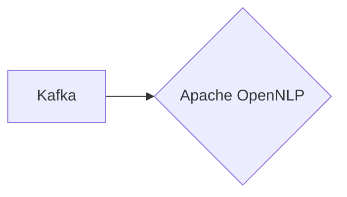

# Connect Kafka to Apache OpenNLP

Quix helps you integrate Kafka to Apache OpenNLP using pure Python.

<a class="md-button md-button--primary" href="https://share.hsforms.com/1iW0TmZzKQMChk0lxd_tGiw4yjw2?__hstc=175542013.2303933fbd746c0ac86d9ccbe9bc9100.1728383268831.1729603416735.1729620918855.31&__hssc=175542013.1.1729620918855&__hsfp=2132701734" target="_blank" style="margin-right:.5rem;">Book a demo</a>
 

## Apache OpenNLP

Apache OpenNLP is an open-source natural language processing technology that provides tools and libraries for a wide range of text analysis tasks, such as tokenization, sentence segmentation, part-of-speech tagging, named entity recognition, and parsing. Developed by the Apache Software Foundation, OpenNLP uses machine learning techniques to build models for processing and understanding human language. With its easy-to-use API and support for multiple languages, OpenNLP can be integrated into various applications and systems to process and analyze text data efficiently. Its robust and scalable capabilities make it a valuable tool for developers and researchers working in the field of natural language processing.

## Integrations

Quix is a good fit for integrating with Apache OpenNLP because of its comprehensive platform designed for developing, deploying, and managing real-time data pipelines. The key components of Quix, such as streamlined development and deployment, enhanced collaboration, real-time monitoring, flexible scaling and management, security and compliance, development tools, data exploration and visualization, CI/CD processes, and Kafka integration, make it well-suited for integrating with Apache OpenNLP.

Apache OpenNLP is a machine learning toolkit for processing natural language text. It includes models for named entity recognition, language detection, part-of-speech tagging, and more. By integrating Apache OpenNLP with Quix, users can enhance their data pipelines with natural language processing capabilities, such as extracting valuable insights from text data, performing sentiment analysis, and improving data classification.

With Quix's support for real-time monitoring, users can track the performance of their Apache OpenNLP models in real-time, optimizing their pipelines for efficiency and accuracy. Additionally, Quix's development tools and flexible scaling options allow for seamless integration of Apache OpenNLP into existing data workflows, enabling organizations to process text data at scale with ease.

Overall, the combination of Quix's features and Apache OpenNLP's capabilities makes for a powerful integration that can streamline data processing tasks, enhance data-driven decision-making, and improve overall operational efficiency.

