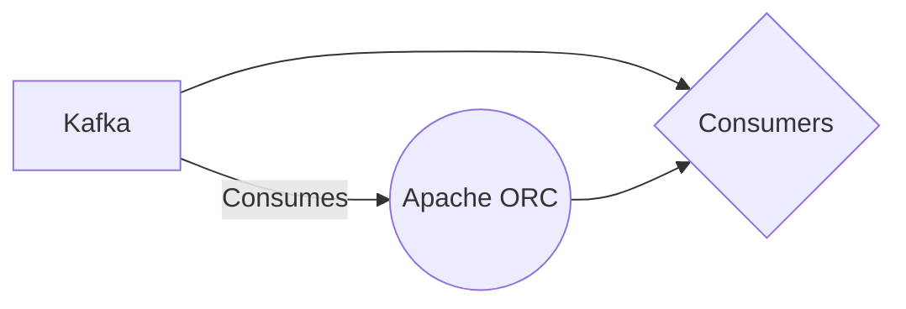

# Connect Kafka to Apache ORC

Quix helps you integrate Kafka to Apache ORC using pure Python.

## Apache ORC

Apache ORC is a high-performance file format designed for storing and processing large volumes of data in big data environments. Developed by the Apache Software Foundation, ORC stands for Optimized Row Columnar and is optimized for reading and writing data efficiently. It offers features such as predicate pushdown, column projection, and optimization for Hadoop and other distributed computing frameworks. ORC files are highly compressed and support complex data types, making it an ideal choice for data warehousing, analytics, and other big data applications. The technology is widely used in the industry for its speed, scalability, and compatibility with popular data processing tools.

## Integrations

Apache ORC (Optimized Row Columnar) is a popular columnar storage format for big data systems like Apache Hive and Apache Spark. It offers various advantages such as efficient compression, predicate pushdown, and lazy reading, making it ideal for storing and processing large datasets.

Quix is a good fit for integrating with Apache ORC due to its comprehensive features and capabilities:

1. Real-Time Processing: Quix Streams enables real-time data processing in Kafka using Python, which can be integrated with Apache ORC for storing and querying data in a columnar format. This allows for efficient processing of streaming data while leveraging the benefits of Apache ORC for storage and retrieval.

2. Scalability: Quix Streams is designed to run and scale via container orchestration, making it well-suited for handling large volumes of data that are typically stored in Apache ORC. The platform's flexible scaling and management capabilities enable users to seamlessly scale resources and manage CPU and memory as needed for processing Apache ORC data.

3. Integration with Python Ecosystem: Quix Streams integrates seamlessly with the Python ecosystem, including popular libraries like Pandas, scikit-learn, TensorFlow, and PyTorch. This makes it easier for users to work with Apache ORC data using familiar tools and frameworks, enhancing productivity and efficiency in data processing tasks.

4. Data Exploration and Visualization: Quix Cloud provides tools for real-time monitoring and data exploration, allowing users to query, explore, and visualize data stored in Apache ORC. This enables users to gain insights from their data and track pipeline performance efficiently.

5. Security and Compliance: Quix Cloud ensures secure management of secrets and compliance with dedicated infrastructure options, making it a reliable choice for handling sensitive data stored in Apache ORC. The platform's robust security features and SLAs provide users with peace of mind when working with critical data assets.

Overall, the combination of Quix with Apache ORC offers a powerful solution for processing, storing, and analyzing large datasets in a scalable and efficient manner. The integration of these technologies can help organizations streamline their data pipelines and improve performance in real-time data processing workflows.

