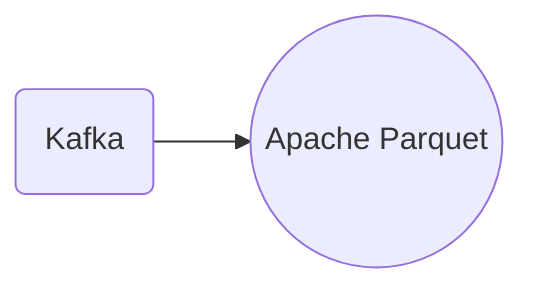

# Connect Kafka to Apache Parquet

Quix helps you integrate Kafka to Apache Parquet using pure Python.

## Apache Parquet

Apache Parquet is a columnar storage format for the Apache Hadoop ecosystem. It is designed to optimize query performance and space efficiency for data processing in big data environments. Parquet stores data in a highly compressed and efficient manner, allowing for fast querying and processing of large datasets. It is compatible with a wide range of data processing frameworks, such as Apache Spark and Apache Hive, making it a versatile and widely used technology in the big data landscape. Parquet also supports complex data types, such as nested data structures and arrays, making it ideal for storing and querying diverse and complex datasets. Overall, Apache Parquet is a powerful and efficient technology for handling big data analytics and processing tasks.

## Integrations

Apache Parquet is a columnar storage format that is designed for efficient analytic queries on Big Data. It is well-suited for use cases where complex queries need to be run on large volumes of data with high performance. 

Quix is a good fit for integrating with Apache Parquet because it provides a comprehensive platform for developing, deploying, and managing real-time data pipelines. With its support for Kafka integration, Quix Streams can ingest data from Kafka topics, process it using Python, and store the results in Parquet format for efficient query processing. 

Additionally, Quix Streams' support for serialization formats and stateful operations using RocksDB makes it easy to work with Parquet files and manage data efficiently. The platform's resilient scaling capabilities ensure that data processing can be scaled up or down based on demand, allowing for optimal performance when working with large Parquet datasets. 

Overall, the combination of Quix with Apache Parquet provides a powerful solution for organizations looking to process and analyze large volumes of data in real-time while benefiting from the performance optimizations offered by the Parquet format.

