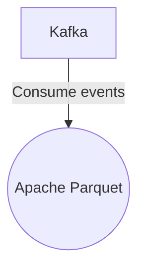

# Connect Kafka to Apache Parquet

Quix helps you integrate Kafka to Apache Parquet using pure Python.

<a class="md-button md-button--primary" href="https://share.hsforms.com/1iW0TmZzKQMChk0lxd_tGiw4yjw2?__hstc=175542013.2303933fbd746c0ac86d9ccbe9bc9100.1728383268831.1729603416735.1729620918855.31&__hssc=175542013.1.1729620918855&__hsfp=2132701734" target="_blank" style="margin-right:.5rem;">Book a demo</a>
 

## Apache Parquet

Apache Parquet is an open-source columnar storage file format that is designed for efficient and optimized data storage and retrieval. It is designed to work seamlessly with various big data processing frameworks such as Apache Hadoop, Apache Spark, and Apache Hive. Parquet is built to support complex nested data structures and is highly optimized for both compression and encoding, reducing storage space and improving query performance. The columnar storage format of Parquet allows for efficient data retrieval by only accessing the columns needed for a particular query, rather than reading entire rows of data. This technology is widely used in data analytics and big data processing applications for its speed, efficiency, and scalability.

## Integrations

Quix is a good fit for integrating with Apache Parquet because it offers a comprehensive platform for developing, deploying, and managing real-time data pipelines. Apache Parquet is a columnar storage format that is optimized for analytics workloads, making it ideal for handling large amounts of data efficiently.

Quix's streamlined development and deployment features, such as integrated online code editors and CI/CD tools, make it easy to create and deploy data pipelines that can process and analyze Apache Parquet files. The platform's support for efficient collaboration and organization management also enhances visibility and control over projects involving Apache Parquet data.

Additionally, Quix Cloud's real-time monitoring capabilities would be beneficial for monitoring the performance of data pipelines processing Apache Parquet files. The platform's flexible scaling and management options allow users to easily adjust resources and manage environments linked to Git branches, ensuring that pipelines running on Apache Parquet data can be optimized for performance.

Furthermore, Quix's integration with Kafka, including support for both Quix-hosted and third-party Kafka solutions, complements Apache Parquet's compatibility with Kafka for data ingestion and processing. Quix Streams, a cloud-native library for processing data in Kafka using Python, can also be utilized to seamlessly integrate with Apache Parquet files, leveraging Python's ecosystem integration and support for serialization and state management.

Overall, Quix's robust development tools, real-time monitoring capabilities, and support for collaboration and scaling make it a good fit for integrating with Apache Parquet to efficiently process and analyze columnar data for analytics workloads.

