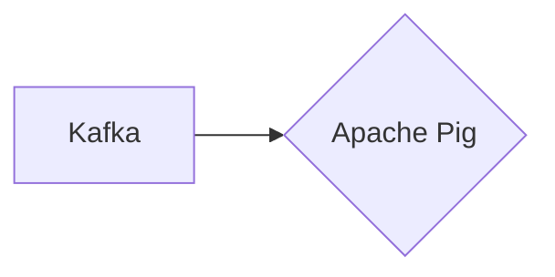

# Connect Kafka to Apache Pig

Quix helps you integrate Kafka to Apache Pig using pure Python.

## Apache Pig

Apache Pig is a high-level platform for creating and executing data flows in Hadoop. This technology allows users to write complex data processing pipelines using a simple scripting language called Pig Latin. Pig Latin abstracts the complexities of MapReduce programming, making it easier for developers to analyze large datasets without having to write extensive Java code. Apache Pig supports a variety of built-in functions and operators for data transformation, manipulation, and analysis, making it a versatile tool for big data processing. Additionally, Pig can be easily integrated with other Apache technologies like Hive, HBase, and Spark, enabling seamless data processing workflows within the Hadoop ecosystem. Overall, Apache Pig is a powerful and efficient tool for performing data processing tasks at scale in a distributed computing environment.

## Integrations

Quix is a good fit for integrating with Apache Pig because both platforms offer a comprehensive set of features for real-time data processing and management. 

Quix Cloud provides streamlined development and deployment tools, enhanced collaboration capabilities, real-time monitoring, flexible scaling and management options, security and compliance features, and robust CI/CD processes. These features align well with Apache Pig's requirements for efficient data processing and management.

Additionally, Quix Streams is specifically designed for processing data in Kafka using Python, making it a suitable choice for Apache Pig integration. The platform's support for serialization and state management, time window aggregations, resilient scaling, and local/Jupyter notebook support further enhance its compatibility with Apache Pig workflows.

Overall, the combination of Quix with Apache Pig offers a powerful solution for developers looking to optimize their data processing pipelines with real-time capabilities, advanced data exploration, and seamless collaboration.

