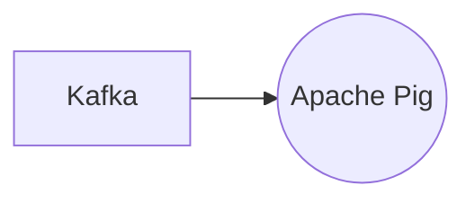

# Connect Kafka to Apache Pig

Quix helps you integrate Kafka to Apache Pig using pure Python.

<a class="md-button md-button--primary" href="https://share.hsforms.com/1iW0TmZzKQMChk0lxd_tGiw4yjw2?__hstc=175542013.2303933fbd746c0ac86d9ccbe9bc9100.1728383268831.1729603416735.1729620918855.31&__hssc=175542013.1.1729620918855&__hsfp=2132701734" target="_blank" style="margin-right:.5rem;">Book a demo</a>
 

## Apache Pig

Apache Pig is a platform that offers a high-level programming language for processing and analyzing large data sets. It simplifies tasks related to data processing by providing a set of operators that allows users to write complex queries without the need for low-level programming. Pig Latin, the language used in Apache Pig, allows users to express data transformations easily, making it a popular choice for data engineers and analysts working with big data. Pig scripts are executed in parallel on a distributed computing framework, such as Apache Hadoop, making it ideal for handling large volumes of data. Overall, Apache Pig streamlines the process of data analysis and manipulation, making it a valuable tool for organizations dealing with vast amounts of data.

## Integrations

Quix is a good fit for integrating with Apache Pig for several reasons:

1. Streamlined Development and Deployment: Quix's integrated online code editors and CI/CD tools simplify the creation and deployment of data pipelines, which aligns well with Apache Pig's focus on simplifying complex data transformations for processing large datasets.

2. Enhanced Collaboration: Quix's support for efficient collaboration through organization and permission management can help teams working with Apache Pig to increase project visibility and control, making it easier to work together on data processing tasks.

3. Real-Time Monitoring: Quix Cloud's tools for real-time logs, metrics, and data exploration can enhance Apache Pig users' ability to monitor pipeline performance and critical metrics in real-time, providing valuable insights for optimizing data processing workflows.

4. Flexible Scaling and Management: With Quix, users can easily scale resources and manage CPU and memory, which can be beneficial for handling the large datasets that Apache Pig is often used to process.

5. Development Tools: Quix Cloud's online code editors and connectors for various data sources and sinks can support Apache Pig users in their data processing tasks, allowing for enhanced workflows and streamlined development processes.

6. Data Exploration and Visualization: Quix's data exploration and visualization capabilities can help Apache Pig users query and explore data more effectively, enabling them to visualize messages and metrics in real-time for improved decision-making.

Overall, Quix's comprehensive platform with its focus on development, collaboration, monitoring, scaling, and security make it a good fit for integrating with Apache Pig for efficient and effective data processing workflows.

