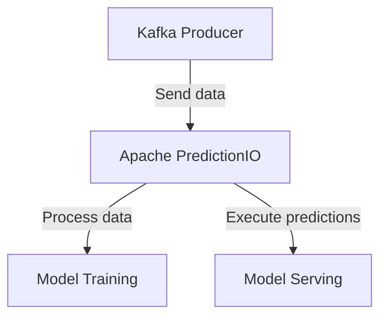

# Connect Kafka to Apache PredictionIO

Quix helps you integrate Kafka to Apache PredictionIO using pure Python.

## Apache PredictionIO

Apache PredictionIO is an open-source machine learning server that provides a complete environment for building predictive analytics solutions. It allows developers to create, evaluate, deploy, and manage predictive models easily and efficiently. With Apache PredictionIO, users can build machine learning models using various algorithms, evaluate their performance, and deploy them in production environments. The platform also provides tools for monitoring and managing the models in real-time, making it easy to scale and update predictions as needed. Overall, Apache PredictionIO simplifies the process of developing and deploying predictive analytics solutions, making it an invaluable tool for businesses looking to leverage the power of machine learning.

## Integrations

Quix is a good fit for integrating with Apache PredictionIO because it offers a comprehensive platform for developing, deploying, and managing real-time data pipelines. It provides streamlined development and deployment features, enhanced collaboration capabilities, real-time monitoring tools, flexible scaling and management options, as well as robust CI/CD processes.

Apache PredictionIO is an open-source machine learning server that allows developers to create predictive engines for various applications. By integrating Apache PredictionIO with Quix, users can take advantage of the platform's capabilities for processing data in Kafka using Python, as well as its seamless integration with the Python ecosystem. The serialization and state management features of Quix Streams can support the complex data processing requirements of machine learning models, while its resilient scaling capabilities can ensure efficient performance when handling large volumes of data.

Additionally, the real-time monitoring tools in Quix Cloud can provide valuable insights into the performance of predictive engines built with Apache PredictionIO, allowing users to track key metrics and make informed decisions about scaling resources or optimizing algorithms. With dedicated infrastructure options and secure management of secrets, Quix Cloud can also help ensure compliance with data privacy regulations and provide a reliable environment for deploying machine learning models.

Overall, the combination of Apache PredictionIO and Quix can offer a powerful solution for organizations looking to develop and deploy predictive models efficiently and effectively.

