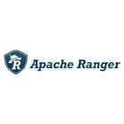

# Connect Kafka to Apache Ranger

Quix helps you integrate Kafka to Apache Ranger using pure Python.

- __Find out how we can help you integrate!__

    <a class="md-button md-button--primary" href="https://share.hsforms.com/1iW0TmZzKQMChk0lxd_tGiw4yjw2?__hstc=175542013.2303933fbd746c0ac86d9ccbe9bc9100.1728383268831.1729603416735.1729620918855.31&__hssc=175542013.1.1729620918855&__hsfp=2132701734" target="_blank" style="margin:.5rem;">Book a demo</a>

## Apache Ranger

Apache Ranger is an open-source technology developed by the Apache Software Foundation that provides comprehensive security management for Hadoop ecosystem components. It allows administrators to define and enforce access control policies for data stored in Hadoop distributed file systems and databases, ensuring that only authorized users can access, modify, or delete sensitive information. Apache Ranger also offers centralized auditing and monitoring capabilities, enabling organizations to track and review user activity to detect any potential security breaches. By providing a robust set of tools for managing security policies across different Hadoop components, Apache Ranger helps enterprises enhance data protection and compliance with regulatory requirements.

## Integrations

Quix is a good fit for integrating with Apache Ranger because of its strong emphasis on security and compliance. Apache Ranger is a comprehensive security framework for managing access control policies across various components in the Hadoop ecosystem. With Quix's emphasis on secure management of secrets and compliance features, it can seamlessly integrate with Apache Ranger to ensure that data pipelines and processing in Quix Cloud are secure and compliant with organizational policies and regulations.

Additionally, Quix's flexible scaling and management capabilities make it easier to manage resources and handle multiple environments, which can be useful in integrating with Apache Ranger to ensure that security policies and access control rules are applied consistently across different environments. Quix's real-time monitoring features also complement Apache Ranger's capabilities by providing real-time insights into pipeline performance and critical metrics, enabling users to effectively monitor and manage security policies and compliance requirements.

Overall, Quix's focus on security, compliance, and efficient collaboration makes it a suitable choice for integrating with Apache Ranger to enhance the security and governance of data pipelines and processing workflows in Quix Cloud.

