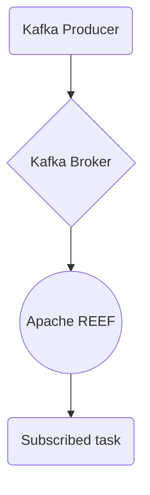

# Connect Kafka to Apache REEF

Quix helps you integrate Kafka to Apache REEF using pure Python.

## Apache REEF

Apache REEF (Retainable Evaluator Execution Framework) is a technology developed for efficiently handling and processing large-scale data sets in distributed computing environments. It provides a flexible and scalable framework that allows users to write and deploy data-intensive applications on a variety of computing resources, such as clusters and cloud platforms. REEF abstracts away the complexity of managing the underlying infrastructure and resources, allowing developers to focus on writing the logic for their applications. By providing an easy-to-use programming model and runtime environment, Apache REEF simplifies the development and deployment of complex data processing applications, making it an essential tool for organizations looking to harness the power of big data.

## Integrations

Quix is a good fit for integrating with Apache REEF because of its robust support for real-time data processing, scalability, and flexibility. Apache REEF is a framework for building distributed applications on top of resource managers like YARN or Kubernetes. By integrating with Quix, users can leverage their streamlined development and deployment tools to quickly create and deploy data pipelines that can be easily scaled and managed.

The enhanced collaboration features of Quix Cloud would also be beneficial when working with Apache REEF, as it allows for efficient organization and permission management, increasing project visibility and control. Additionally, the real-time monitoring capabilities of Quix Cloud would enable users to monitor pipeline performance and critical metrics when running applications on Apache REEF.

Furthermore, Quix Cloud's support for Kubernetes and container orchestration aligns well with Apache REEF's resilient scaling capabilities. Users can easily run and scale their applications via container orchestration when integrating with Quix Cloud, ensuring optimal performance and resource utilization.

Overall, the comprehensive features of Quix make it a suitable choice for integrating with Apache REEF, providing users with a powerful platform for developing, deploying, and managing real-time data pipelines effectively.

