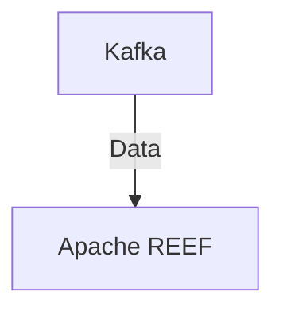

# Connect Kafka to Apache REEF

Quix helps you integrate Kafka to Apache REEF using pure Python.

- __Find out how we can help you integrate!__

    <a class="md-button md-button--primary" href="https://share.hsforms.com/1iW0TmZzKQMChk0lxd_tGiw4yjw2?__hstc=175542013.2303933fbd746c0ac86d9ccbe9bc9100.1728383268831.1729603416735.1729620918855.31&__hssc=175542013.1.1729620918855&__hsfp=2132701734" target="_blank" style="margin:.5rem;">Book a demo</a>

## Apache REEF

Apache REEF (Retainable Evaluator Execution Framework) is a technology designed to simplify the development and execution of large-scale computations on distributed systems. It provides a flexible programming model that allows developers to write their algorithms and easily scale them out on clusters of computers. Apache REEF enables efficient resource utilization by managing the lifecycle of application components, such as tasks and evaluators, and provides fault tolerance mechanisms to ensure reliable computation in the face of failures. With its support for multiple programming languages and integration with various big data frameworks, Apache REEF is a versatile tool for building scalable and resilient data processing applications.

## Integrations

Quix is a good fit for integrating with Apache REEF because of its comprehensive platform designed for developing, deploying, and managing real-time data pipelines. Apache REEF is a framework for developing and running large-scale data processing applications, and Quix's features align well with the requirements of such applications.

Here are a few reasons why Quix is a good fit for integrating with Apache REEF:

1. Streamlined Development and Deployment: Quix provides integrated online code editors and CI/CD tools, making it easy to create and deploy data pipelines. This aligns well with Apache REEF's goal of simplifying the development and deployment of data processing applications.

2. Real-Time Monitoring: Quix Cloud offers tools for real-time logs, metrics, and data exploration, which are essential for monitoring pipeline performance in real-time. This complements Apache REEF's need for monitoring and managing large-scale data processing applications.

3. Scalability and Management: Quix Cloud allows users to easily scale resources, manage CPU and memory, and handle multiple environments linked to Git branches. This scalability feature is crucial for running large-scale data processing applications using Apache REEF.

4. Kafka Integration: Quix Cloud supports both Quix-hosted and third-party Kafka solutions, including Confluent Cloud and Redpanda. This integration with Kafka aligns well with Apache REEF's support for processing data in real-time using messaging systems like Kafka.

5. Python Ecosystem Integration: Quix Streams, a cloud-native library for processing data in Kafka using Python, seamlessly integrates with Quix. This is beneficial for developers who prefer to work with Python libraries like Pandas, scikit-learn, TensorFlow, and PyTorch.

Overall, the features offered by Quix, such as streamlined development, real-time monitoring, scalability, Kafka integration, and Python ecosystem support, make it a good fit for integrating with Apache REEF for developing and running large-scale data processing applications.

