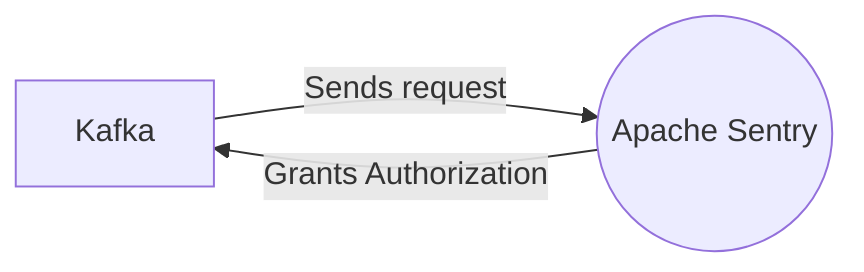

# Connect Kafka to Apache Sentry

Quix helps you integrate Kafka to Apache Sentry using pure Python.

## Apache Sentry

Apache Sentry is a powerful and flexible technology that provides fine-grained authorization for Big Data platforms such as Apache Hadoop and Apache Hive. This open-source software allows users to define and enforce security policies for data access within the cluster, ensuring that only authorized users can perform specific actions on data sets. Apache Sentry integrates seamlessly with various authentication mechanisms, allowing organizations to control access based on user roles, groups, and privileges. With Apache Sentry, administrators can easily manage permissions and audit trails, making it an essential tool for securing sensitive data in large-scale distributed systems.

## Integrations

Apache Sentry is a powerful tool for creating and managing fine-grained access control for data stored in Apache Hadoop. By integrating Quix with Apache Sentry, organizations can ensure secure data processing and access within their data pipelines.

Quix Streams, with its cloud-native library for processing data in Kafka using Python, can benefit from Apache Sentry's access control features by ensuring that only authorized users can interact with sensitive data within the Kafka streams. This helps organizations comply with security and compliance regulations and protects their data from unauthorized access.

Furthermore, Quix Cloud's security and compliance features, such as secure management of secrets and compliance with dedicated infrastructure options, align well with Apache Sentry's capabilities for enforcing access control policies and permissions. By combining the security features of both Quix Cloud and Apache Sentry, organizations can create a secure and compliant data processing environment that protects their data throughout the pipeline.

In addition, Quix Streams and Quix Cloud's flexible scaling and management capabilities can also complement Apache Sentry's access control policies by allowing organizations to easily scale resources, manage CPU and memory, and handle multiple environments linked to Git branches, all while ensuring that access control policies are enforced consistently across the pipeline.

Overall, integrating Quix with Apache Sentry enables organizations to create a secure, compliant, and efficient data processing environment that protects their data and ensures that only authorized users can access and interact with sensitive information within their pipelines.

