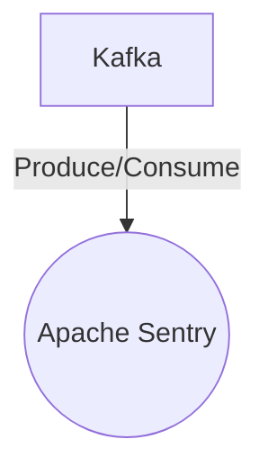

# Connect Kafka to Apache Sentry

Quix helps you integrate Kafka to Apache Sentry using pure Python.

- __Find out how we can help you integrate!__

    <a class="md-button md-button--primary" href="https://share.hsforms.com/1iW0TmZzKQMChk0lxd_tGiw4yjw2?__hstc=175542013.2303933fbd746c0ac86d9ccbe9bc9100.1728383268831.1729603416735.1729620918855.31&__hssc=175542013.1.1729620918855&__hsfp=2132701734" target="_blank" style="margin:.5rem;">Book a demo</a>

## Apache Sentry

Apache Sentry is an open-source, enterprise-grade access control system that enables organizations to secure and manage their data infrastructure. With Apache Sentry, users can define fine-grained authorization policies for data access within their Hadoop ecosystem, including HDFS, HBase, and Hive. This technology allows organizations to restrict access to sensitive data, control user privileges, and ensure compliance with security regulations. By providing centralized authorization management, Apache Sentry helps organizations enhance their data security posture and minimize the risk of unauthorized access or data breaches.

## Integrations

Quix is a good fit for integrating with Apache Sentry because of its robust security features and compliance capabilities. Apache Sentry is a powerful system for enforcing fine-grained access control policies for Hadoop data and metadata. By integrating Quix with Apache Sentry, organizations can ensure that their data pipelines are secure and compliant with regulations.

Quix provides features for secure management of secrets, organization and permission management, and dedicated infrastructure options, making it a great match for organizations looking to enhance their security and compliance measures. With Quix, users can easily define and manage access control policies, monitor pipeline performance, and handle sensitive data securely.

Additionally, Quix Cloud's support for real-time monitoring, flexible scaling, and integration with CI/CD processes makes it a comprehensive solution for organizations looking to streamline their data pipeline development and deployment workflows. By integrating Quix with Apache Sentry, organizations can enhance their security posture while benefiting from Quix's comprehensive set of features for developing, deploying, and managing real-time data pipelines.

