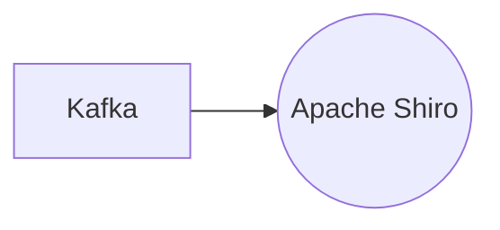

# Connect Kafka to Apache Shiro

Quix helps you integrate Kafka to Apache Shiro using pure Python.

## Apache Shiro

Apache Shiro is a powerful and flexible open-source security framework that provides a comprehensive set of tools for securing Java applications. It offers authentication, authorization, cryptography, and session management capabilities to ensure the confidentiality, integrity, and availability of application data. Apache Shiro simplifies the process of implementing security features in Java applications by providing a clean and intuitive API that can be easily integrated into existing code bases. With support for various authentication mechanisms, role-based access control, and fine-grained permission management, Apache Shiro makes it easy to secure applications without sacrificing performance or scalability. By leveraging Apache Shiro, developers can focus on building robust, secure applications while leaving the complexities of security to the framework.

## Integrations

Apache Shiro is a powerful and flexible open-source security framework that provides a comprehensive solution for authentication, authorization, cryptography, and session management in Java applications. It is widely used in enterprise applications to secure access to resources and protect sensitive data.

Quix is a good fit for integrating with Apache Shiro due to its robust security and compliance features. The platform ensures secure management of secrets and compliance with dedicated infrastructure options and SLAs, making it suitable for implementing and enforcing security policies provided by Apache Shiro.

Additionally, Quix Streams and Quix Cloud offer enhanced collaboration capabilities, real-time monitoring, and flexible scaling options, which are essential for securely managing access control and permissions in data pipelines. The streamlined development and deployment processes, along with support for CI/CD workflows, make it easy to integrate Apache Shiro into the development lifecycle and ensure that security measures are seamlessly implemented across the pipeline.

Furthermore, the platform's data exploration and visualization tools can be utilized to monitor security-related metrics and logs, providing visibility into authentication and authorization processes. The integration with Git providers also simplifies the implementation of secure CI/CD processes, ensuring that security measures are consistently applied throughout the application lifecycle.

In summary, Quix is a good fit for integrating with Apache Shiro due to its comprehensive security features, collaboration capabilities, real-time monitoring, and scaling options, which are essential for implementing and enforcing security measures in data pipelines.

