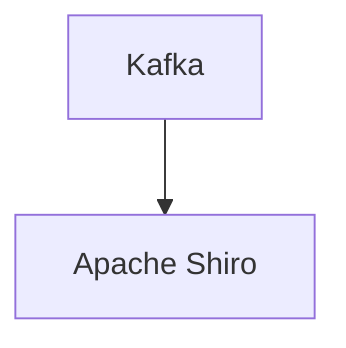

# Connect Kafka to Apache Shiro

Quix helps you integrate Kafka to Apache Shiro using pure Python.

<a class="md-button md-button--primary" href="https://share.hsforms.com/1iW0TmZzKQMChk0lxd_tGiw4yjw2?__hstc=175542013.2303933fbd746c0ac86d9ccbe9bc9100.1728383268831.1729603416735.1729620918855.31&__hssc=175542013.1.1729620918855&__hsfp=2132701734" target="_blank" style="margin-right:.5rem;">Book a demo</a>
 

## Apache Shiro

Apache Shiro is a powerful and flexible open-source security framework that provides authentication, authorization, cryptography, and session management for Java applications. It simplifies the process of implementing security features in software by providing a set of easy-to-use APIs and components that can be easily integrated into existing applications. With Apache Shiro, developers can easily secure their applications and protect sensitive data without having to write complex and error-prone security code from scratch. It supports a wide range of authentication mechanisms, such as LDAP, OAuth, and custom realms, making it suitable for a variety of use cases. Additionally, Apache Shiro's modular design allows developers to extend its functionality and customize its features to meet their specific security requirements.

## Integrations

Quix is a good fit for integrating with Apache Shiro because it offers extensive security and compliance features that complement the authentication and authorization capabilities provided by Apache Shiro. With Quix's secure management of secrets, dedicated infrastructure options, and SLAs, it can seamlessly integrate with Apache Shiro to provide robust security measures for data pipelines and applications. Quix's flexible scaling and management features also ensure that resources can be efficiently managed in compliance with security protocols enforced by Apache Shiro.

Additionally, Quix Streams, a cloud-native library integrated with Quix, offers support for serialization and state management, which can be important for ensuring secure data processing within Apache Shiro authentication contexts. The library's resilience in scaling and support for time window aggregations further enhance its compatibility with Apache Shiro's data security requirements.

By combining the features of Quix Cloud and Quix Streams with Apache Shiro's authentication and authorization capabilities, organizations can benefit from a comprehensive approach to data pipeline security and compliance. This integration can help ensure that sensitive data is protected, access controls are enforced, and compliance standards are met throughout the development, deployment, and management of real-time data pipelines.

