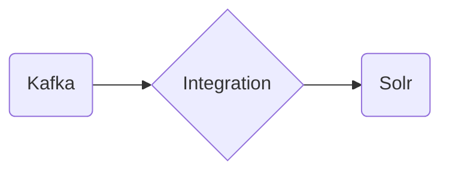

# Connect Kafka to Apache Solr

Quix helps you integrate Kafka to Apache Solr using pure Python.

## Apache Solr

Apache Solr is an open-source search platform built on Apache Lucene, designed to deliver fast and reliable search results for websites, applications, and databases. It is highly scalable and can handle large volumes of data, making it an ideal choice for organizations with complex search requirements. Solr uses advanced indexing and querying capabilities to provide accurate and relevant search results, including support for faceted search, hit highlighting, and spell checking. With its robust features and flexible configuration options, Apache Solr is a popular choice for businesses looking to enhance their search capabilities and improve user experience.

## Integrations

Quix is a good fit for integrating with Apache Solr because of its comprehensive platform designed for developing, deploying, and managing real-time data pipelines. Apache Solr is an open-source search platform built on Apache Lucene, used for searching, indexing, and analyzing large volumes of data.

By integrating Quix with Apache Solr, organizations can benefit from the following:

1. Streamlined Development and Deployment: Quix Streams' online code editors and CI/CD tools simplify the creation and deployment of data pipelines, making it easier to integrate and leverage Apache Solr in the data processing workflow.

2. Real-Time Monitoring: Quix Cloud provides tools for real-time logs, metrics, and data exploration, allowing users to monitor pipeline performance, which is crucial when working with Apache Solr for real-time data analysis.

3. Flexible Scaling and Management: Quix Cloud's ability to easily scale resources and manage CPU and memory is beneficial when integrating with Apache Solr, which often requires handling large volumes of data and complex queries.

4. Data Exploration and Visualization: Quix Cloud allows users to query and explore data in real-time, which complements Apache Solr's capabilities for indexing and analyzing data quickly and efficiently.

5. Enhanced Collaboration: Quix Cloud supports efficient collaboration with organization and permission management, increasing project visibility and control, which is essential when multiple teams are working with Apache Solr for different use cases.

Overall, the features provided by Quix align well with the requirements of integrating with Apache Solr, offering a seamless and efficient experience for developing, deploying, and managing real-time data pipelines that leverage the power of Apache Solr for search and analysis.

