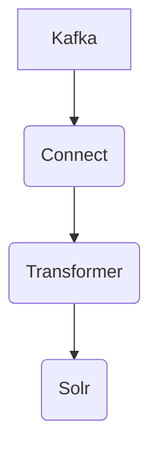

# Connect Kafka to Apache Solr

Quix helps you integrate Kafka to Apache Solr using pure Python.

<a class="md-button md-button--primary" href="https://share.hsforms.com/1iW0TmZzKQMChk0lxd_tGiw4yjw2?__hstc=175542013.2303933fbd746c0ac86d9ccbe9bc9100.1728383268831.1729603416735.1729620918855.31&__hssc=175542013.1.1729620918855&__hsfp=2132701734" target="_blank" style="margin-right:.5rem;">Book a demo</a>
 

## Apache Solr

Apache Solr is a powerful, open-source search platform that is used to build search functionality into websites and applications. It is based on the Apache Lucene search library and provides a fast and scalable solution for indexing and searching large volumes of text-based data. Solr features advanced full-text search capabilities, faceted search, hit highlighting, and geospatial search functionality. It can be easily integrated with other technologies and databases, making it a versatile tool for developers looking to enhance the search capabilities of their applications. With its robust features and community support, Apache Solr is a popular choice for organizations looking to implement efficient and accurate search functionality.

## Integrations

Apache Solr is a powerful search platform that is widely used for indexing and searching large volumes of data. It offers features such as full-text search, faceted search, and filtering, making it an ideal choice for managing and querying complex datasets. Quix, with its focus on real-time data pipelines and data exploration, complements Apache Solr by providing streamlined development and deployment processes, real-time monitoring capabilities, and flexible scaling options.

Quix's integrated online code editors and CI/CD tools make it easy to create and deploy data pipelines, which can include processes for indexing and querying data in Apache Solr. The platform's support for collaboration and organization management ensures that teams can work efficiently on Solr-related projects, with visibility and control over pipeline performance and critical metrics.

Additionally, Quix's integration with Git providers like GitHub and Bitbucket enables seamless CI/CD processes, allowing for synchronization of pipeline code and configurations with version control systems. This ensures that changes to Solr indexes and queries can be tracked and managed effectively.

Furthermore, Quix Streams, a cloud-native library for processing data in Kafka using Python, can be leveraged to ingest data into Apache Solr from Kafka streams. This integration allows for real-time updates to Solr indexes, supporting use cases that require up-to-date search results based on changing data.

In summary, Quix is a good fit for integrating with Apache Solr due to its comprehensive features for developing, deploying, and managing real-time data pipelines. The platform's focus on collaboration, monitoring, and scaling aligns well with the requirements of managing and querying data in Apache Solr, making it a valuable tool for organizations looking to enhance their search capabilities.

