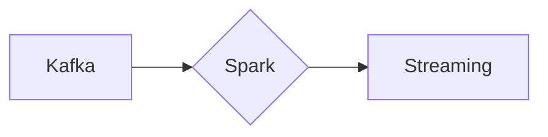

# Connect Kafka to Apache Spark

Quix helps you integrate Kafka to Apache Spark using pure Python.

## Apache Spark

Apache Spark is an open-source, distributed computing technology that provides a fast and general-purpose platform for big data processing. It is designed to efficiently handle large datasets in a parallel and fault-tolerant manner. Spark's main feature is its in-memory processing capabilities, which allow for swift data processing speeds and iterative algorithms. Spark also supports a wide range of programming languages, such as Java, Python, and Scala, making it accessible to a broad community of developers. Overall, Apache Spark is a powerful tool that enables users to perform complex data analytics and machine learning tasks at scale.

## Integrations

Quix is a good fit for integrating with Apache Spark due to its comprehensive platform designed for developing, deploying, and managing real-time data pipelines. Apache Spark is a powerful open-source distributed computing system that provides an efficient way to process large volumes of data. By integrating with Quix, users can leverage the following benefits:

1. Streamlined Development and Deployment: Quix Cloud offers integrated online code editors and CI/CD tools that simplify the creation and deployment of data pipelines, making it easier to work with Apache Spark's complex processing tasks.

2. Enhanced Collaboration: Quix Cloud supports efficient collaboration with organization and permission management, increasing visibility and control over Apache Spark projects, allowing teams to work together seamlessly.

3. Real-Time Monitoring: Quix Cloud provides tools for real-time logs, metrics, and data exploration, allowing users to monitor pipeline performance and critical metrics processed by Apache Spark in real-time.

4. Flexible Scaling and Management: Quix Cloud allows users to easily scale resources, manage CPU and memory, and handle multiple environments linked to Git branches, which is essential for handling the high volumes of data processed by Apache Spark.

5. Security and Compliance: The platform ensures secure management of secrets and compliance with dedicated infrastructure options and SLAs, providing a secure environment for running Apache Spark jobs.

6. Development Tools: Quix Cloud includes online code editors, code templates, and connectors for various data sources and sinks, supporting DevContainers for enhanced workflows, making it easier to work with Apache Spark.

7. Data Exploration and Visualization: Users can query and explore data using waveform and table views, and visualize messages and metrics in real-time, providing valuable insights into the data processed by Apache Spark.

Overall, Quix provides a robust platform for developing, deploying, and managing real-time data pipelines, making it an ideal fit for integrating with Apache Spark to leverage its distributed computing capabilities for processing large volumes of data.

