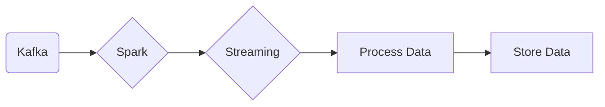

# Connect Kafka to Apache Spark

Quix helps you integrate Kafka to Apache Spark using pure Python.

- __Find out how we can help you integrate!__

    <a class="md-button md-button--primary" href="https://share.hsforms.com/1iW0TmZzKQMChk0lxd_tGiw4yjw2?__hstc=175542013.2303933fbd746c0ac86d9ccbe9bc9100.1728383268831.1729603416735.1729620918855.31&__hssc=175542013.1.1729620918855&__hsfp=2132701734" target="_blank" style="margin:.5rem;">Book a demo</a>

## Apache Spark

Apache Spark is a powerful, open-source, distributed computing system that is designed to process and analyze large volumes of data quickly and efficiently. It provides a lightning-fast cluster computing system that can run various tasks in memory or on disk, making it up to 100 times faster than traditional MapReduce processing. Spark is built on the concept of resilient distributed datasets (RDDs), which allow for fault-tolerant distributed data processing. With its rich APIs in multiple languages like Java, Scala, Python, and R, Spark is an extremely versatile tool for data engineers and data scientists to perform advanced analytics, machine learning, and real-time processing on massive datasets. Its flexibility, speed, and ease of use make Apache Spark a top choice for big data processing and analytics in the modern era.

## Integrations

Quix is a good fit for integrating with Apache Spark because of its comprehensive platform designed for developing, deploying, and managing real-time data pipelines. 

1. Streamlined Development and Deployment: Quix's integrated online code editors and CI/CD tools simplify the creation and deployment of data pipelines, which aligns well with Apache Spark's focus on streamlining data processing workflows.

2. Enhanced Collaboration: Quix supports efficient collaboration with organization and permission management, providing increased project visibility and control, which is crucial for teams working with Apache Spark on large-scale data processing tasks.

3. Real-Time Monitoring: Quix Cloud provides tools for real-time logs, metrics, and data exploration, allowing users to monitor pipeline performance and critical metrics, which complements Apache Spark's ability to process data in real-time.

4. Flexible Scaling and Management: Quix allows users to easily scale resources, manage CPU and memory, and handle multiple environments linked to Git branches, which is essential for managing the distributed computing capabilities of Apache Spark.

5. Security and Compliance: Quix ensures secure management of secrets and compliance with dedicated infrastructure options and SLAs, which is important for organizations working with sensitive data using Apache Spark.

6. Development Tools: Quix Cloud includes online code editors, code templates, and connectors for various data sources and sinks, supporting DevContainers for enhanced workflows, which can enhance the development and debugging process when working with Apache Spark.

In addition, Quix Streams, a cloud-native library for processing data in Kafka using Python, can also be integrated with Apache Spark, enabling seamless integration of data processing tasks between the two technologies. The benefits of Quix Streams, such as Python ecosystem integration, serialization and state management, time window aggregations, and resilient scaling, can further enhance the capabilities of Apache Spark in processing and analyzing real-time data streams.

