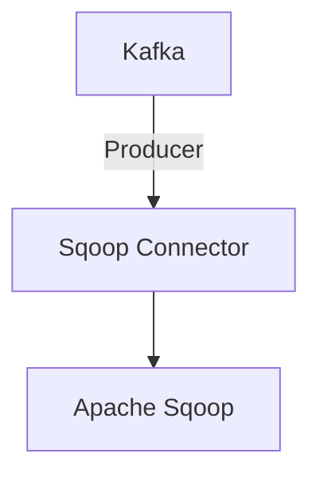

# Connect Kafka to Apache Sqoop

Quix helps you integrate Kafka to Apache Sqoop using pure Python.

Here is the simple Mermaid diagram for integrating Kafka with Apache Sqoop:

## Apache Sqoop

Apache Sqoop is an open-source technology that facilitates the transfer of data between Apache Hadoop and relational databases. By providing a simple command-line interface, Sqoop allows users to import data from databases such as MySQL, Oracle, and PostgreSQL into Hadoop for analysis and processing. Additionally, Sqoop enables users to export data from Hadoop back into these databases. This tool streamlines the data transfer process, making it easier for organizations to incorporate data from various sources into their big data ecosystem. With its efficiency and scalability, Apache Sqoop is a valuable tool for data engineers and analysts working with large volumes of data in the Hadoop ecosystem.

## Integrations

Apache Sqoop is a technology that is commonly used for transferring bulk data between Apache Hadoop and structured data stores such as relational databases. It is often used in big data pipelines to ingest and export data efficiently.

Quix would be a good fit for integrating with Apache Sqoop because of its comprehensive platform designed for developing, deploying, and managing real-time data pipelines. With features like streamlined development and deployment, enhanced collaboration, real-time monitoring, flexible scaling and management, and robust CI/CD processes, Quix provides a robust environment for managing data pipelines efficiently.

By integrating Quix with Apache Sqoop, users can enhance their data ingestion and export processes by leveraging the features of Quix such as real-time monitoring, flexible scaling, and secure management of secrets. The platform's support for various data sources and sinks, as well as its integration with Git providers and Kafka, further enhances the capabilities of Apache Sqoop in managing data transfers effectively.

Overall, the combination of Quix with Apache Sqoop provides a powerful solution for managing data pipelines efficiently and securely, making it a good fit for organizations looking to streamline their big data workflows.

