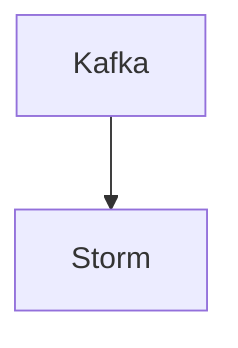

# Connect Kafka to Apache Storm

Quix helps you integrate Kafka to Apache Storm using pure Python.

- __Find out how we can help you integrate!__

    <a class="md-button md-button--primary" href="https://share.hsforms.com/1iW0TmZzKQMChk0lxd_tGiw4yjw2?__hstc=175542013.2303933fbd746c0ac86d9ccbe9bc9100.1728383268831.1729603416735.1729620918855.31&__hssc=175542013.1.1729620918855&__hsfp=2132701734" target="_blank" style="margin:.5rem;">Book a demo</a>

## Apache Storm

Apache Storm is a real-time computational engine that allows users to process large volumes of data in a fast and reliable manner. It is used for stream processing tasks such as data analytics, machine learning, and continuous computation. Storm is designed to be highly scalable, fault-tolerant, and easily integrated with other technologies. It utilizes a concept called "topology" to define data flow and processing logic, which can be distributed across multiple nodes in a cluster for parallel processing. Storm is widely used in various industries for real-time data processing and has become a popular choice for organizations looking to harness the power of big data for actionable insights.

## Integrations

Quix is a good fit for integrating with Apache Storm because of its comprehensive platform designed for developing, deploying, and managing real-time data pipelines. Apache Storm is a distributed real-time computation system that allows for processing large volumes of data in real-time. By integrating with Quix, users can leverage the streamlined development and deployment features of the platform, allowing for the easy creation and deployment of data pipelines.

Furthermore, Quix's support for enhanced collaboration features such as organization and permission management can facilitate teamwork and increase project visibility and control when working with Apache Storm. The real-time monitoring capabilities of Quix Cloud also align well with the real-time processing capabilities of Apache Storm, allowing users to monitor pipeline performance and critical metrics in real-time.

Additionally, Quix Cloud's flexible scaling and management options can support Apache Storm's scalability requirements, allowing users to easily scale resources, manage CPU and memory, and handle multiple environments linked to Git branches. The platform's security and compliance features also ensure secure management of secrets and compliance with dedicated infrastructure options and SLAs, which is crucial when working with sensitive data in real-time processing pipelines.

In addition, Quix Cloud's development tools, data exploration and visualization capabilities, and robust CI/CD processes can further enhance the integration with Apache Storm, providing users with a comprehensive platform for developing, deploying, and managing real-time data pipelines. Furthermore, Quix Streams, which is a cloud-native library for processing data in Kafka using Python, can also complement Apache Storm's capabilities by providing a user-friendly Python interface for processing data in Kafka. Overall, Quix's features and capabilities make it a strong fit for integrating with Apache Storm to support real-time data processing requirements.

