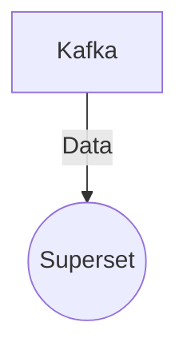

# Connect Kafka to Apache Superset

Quix helps you integrate Kafka to Apache Superset using pure Python.

- __Find out how we can help you integrate!__

    <a class="md-button md-button--primary" href="https://share.hsforms.com/1iW0TmZzKQMChk0lxd_tGiw4yjw2?__hstc=175542013.2303933fbd746c0ac86d9ccbe9bc9100.1728383268831.1729603416735.1729620918855.31&__hssc=175542013.1.1729620918855&__hsfp=2132701734" target="_blank" style="margin:.5rem;">Book a demo</a>

## Apache Superset

Apache Superset is an open-source data visualization and exploration platform that allows users to create interactive dashboards and visualizations from various data sources. With its intuitive and user-friendly interface, Superset enables users to easily connect to databases, CSV files, and other data sources to analyze and visualize data in real-time. Its wide range of visualization options, including charts, graphs, and maps, make it a powerful tool for exploring and understanding complex datasets. Additionally, Superset's ability to handle large amounts of data and its support for multi-tenancy and role-based access control make it a versatile and scalable solution for organizations of all sizes.

## Integrations

Quix is a good fit for integrating with Apache Superset due to its comprehensive platform that offers streamlined development and deployment, enhanced collaboration, real-time monitoring and scaling capabilities, and data exploration and visualization features. 

Apache Superset is a data exploration and visualization tool that can benefit from Quix's real-time monitoring tools and streaming capabilities. Quix's integration with Kafka will allow Apache Superset users to process data in real-time and seamlessly visualize it using the platform's data exploration and visualization tools. Additionally, Quix's flexible scaling and management features will enable Apache Superset users to easily scale resources and manage CPU and memory for their data pipelines.

Furthermore, Quix's development tools, such as online code editors and connectors for various data sources, will enhance the collaboration and development process when integrating with Apache Superset. The platform's integration with Git providers like GitHub and Bitbucket will also facilitate seamless CI/CD processes, enabling Apache Superset users to efficiently deploy their data pipelines.

Overall, Quix's cloud-native library, Quix Streams, and its features align well with Apache Superset's data exploration and visualization capabilities, making it a suitable integration for users looking to enhance their data pipeline development and monitoring processes.

