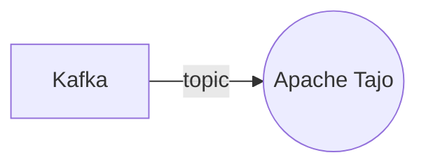

# Connect Kafka to Apache Tajo

Quix helps you integrate Kafka to Apache Tajo using pure Python.

## Apache Tajo

Apache Tajo is a distributed data warehouse system that allows users to query and analyze large datasets in a fast and efficient manner. It provides a SQL engine that supports complex queries, allowing users to perform analytics on vast amounts of data with ease. Apache Tajo is designed to be highly scalable and fault-tolerant, ensuring that it can handle even the largest datasets without any performance degradation. With its distributed architecture, Apache Tajo can be deployed on a cluster of machines, allowing for parallel processing of queries and maximizing the system's efficiency. Overall, Apache Tajo is a powerful technology that enables users to process and analyze big data with ease and speed.

## Integrations

Quix is a good fit for integrating with Apache Tajo because of its comprehensive platform for developing, deploying, and managing real-time data pipelines. 

1. Streamlined Development and Deployment: Quix Cloud offers integrated online code editors and CI/CD tools, which can simplify the creation and deployment of data pipelines in Apache Tajo.

2. Enhanced Collaboration: With organization and permission management features, Quix Cloud can promote efficient collaboration when integrating with Apache Tajo.

3. Real-Time Monitoring: Quix Cloud provides tools for real-time logs, metrics, and data exploration, allowing users to monitor pipeline performance and critical metrics in Apache Tajo.

4. Flexible Scaling and Management: Users can easily scale resources and manage CPU and memory, which can be beneficial when integrating with the scalable capabilities of Apache Tajo.

5. Security and Compliance: Quix Cloud ensures secure management of secrets and compliance, which is crucial when handling sensitive data in Apache Tajo.

6. Development Tools: The platform includes online code editors, code templates, and connectors for various data sources and sinks, supporting DevContainers for enhanced workflows in Apache Tajo.

7. Data Exploration and Visualization: Users can query and explore data using waveform and table views, which can be valuable when working with data in Apache Tajo.

In addition, Quix Streams can be a great fit for integrating with Apache Tajo as it is a cloud-native library that operates without a JVM, works seamlessly with Python ecosystem libraries, supports serialization and state management, and offers features like time window aggregations and resilient scaling, which can be advantageous for processing data in Kafka within the Apache Tajo environment. Moreover, the local and Jupyter Notebook support in Quix Streams can facilitate convenient development and debugging when working with Apache Tajo.

