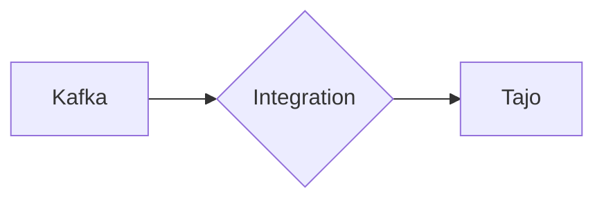

# Connect Kafka to Apache Tajo

Quix helps you integrate Kafka to Apache Tajo using pure Python.

<a class="md-button md-button--primary" href="https://share.hsforms.com/1iW0TmZzKQMChk0lxd_tGiw4yjw2?__hstc=175542013.2303933fbd746c0ac86d9ccbe9bc9100.1728383268831.1729603416735.1729620918855.31&__hssc=175542013.1.1729620918855&__hsfp=2132701734" target="_blank" style="margin-right:.5rem;">Book a demo</a>
 

## Apache Tajo

Apache Tajo is an open-source, distributed data warehouse system that is designed to handle large-scale data processing tasks. It offers high-performance querying and data analytics capabilities, making it suitable for processing massive datasets in parallel. Apache Tajo is built on top of the Hadoop distributed file system (HDFS) and uses SQL as its query language, allowing users to easily analyze and manipulate data using familiar commands. With its scalable architecture and support for various data formats, Apache Tajo is a powerful tool for organizations looking to efficiently manage and analyze their big data workloads.

## Integrations

Quix is a good fit for integrating with Apache Tajo because it provides a comprehensive platform for developing, deploying, and managing real-time data pipelines. The key components of Quix, such as streamlined development and deployment, enhanced collaboration, real-time monitoring, flexible scaling and management, and development tools, align well with the capabilities of Apache Tajo.

1. Streamlined Development and Deployment: Quix's integrated online code editors and CI/CD tools simplify the creation and deployment of data pipelines, which complements Apache Tajo's focus on efficient data processing and analysis.

2. Enhanced Collaboration: Quix's support for organization and permission management enhances collaboration among team members working on Apache Tajo projects, increasing project visibility and control.

3. Real-Time Monitoring: Quix Cloud's tools for real-time logs, metrics, and data exploration allow users to monitor pipeline performance in real-time, providing valuable insights for optimizing data processing in Apache Tajo.

4. Flexible Scaling and Management: Quix's ability to easily scale resources and manage CPU and memory aligns with Apache Tajo's requirements for handling large-scale data processing tasks efficiently.

5. Security and Compliance: Quix's secure management of secrets and compliance with dedicated infrastructure options ensures that data processed by Apache Tajo remains secure and compliant with industry regulations.

Moreover, Quix Streams, a cloud-native library for processing data in Kafka using Python, can also enhance the integration with Apache Tajo, as it provides benefits such as Python ecosystem integration, serialization and state management, time window aggregations, resilient scaling, and support for local and Jupyter notebook development. This can further extend the capabilities of Apache Tajo for processing and analyzing real-time data streams effectively.

