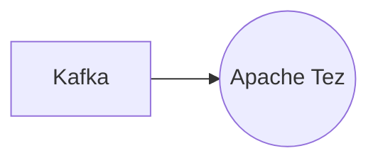

# Connect Kafka to Apache Tez

Quix helps you integrate Kafka to Apache Tez using pure Python.

## Apache Tez

Apache Tez is a distributed processing framework built on top of Apache Hadoop and designed to improve the performance of batch and interactive processing applications. It provides a flexible execution engine that allows developers to create complex data processing workflows with ease. With Tez, users can write custom application logic in any programming language and take advantage of its efficient data movement capabilities. By optimizing resource allocation and task scheduling, Tez enables faster data processing and improved job performance. Overall, Apache Tez is a powerful technology that helps organizations process large datasets more efficiently and effectively.

## Integrations

Apache Tez is a data processing framework that is designed to improve the performance and efficiency of data processing tasks on Hadoop clusters. It's a good fit for integrating with Quix because these platforms are specifically built for developing, deploying, and managing real-time data pipelines.

Quix Streams provides a user-friendly Python interface for processing data in Kafka, making it easy to work with data in real-time. This aligns well with Apache Tez's goal of improving the performance of data processing tasks, as Quix Streams can leverage Tez's capabilities to enhance the efficiency of processing large volumes of data.

Additionally, Quix Cloud offers streamlined development and deployment tools, which can simplify the integration process with Apache Tez. The platform supports collaboration, real-time monitoring, and scaling capabilities, all of which are important for effectively integrating with a data processing framework like Tez.

Overall, the combination of Quix with Apache Tez can provide a powerful solution for organizations looking to streamline their data processing workflows and enhance the performance of their data pipelines.

