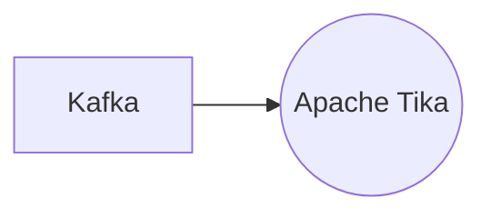

# Connect Kafka to Apache Tika

Quix helps you integrate Kafka to Apache Tika using pure Python.

## Apache Tika

Apache Tika is a software library that is used for extracting text and metadata from various file formats such as documents, images, and videos. It is an open-source project developed by the Apache Software Foundation and provides a simple and consistent interface for content detection and extraction. By using Apache Tika, developers can easily parse and access information from a wide range of files without having to implement custom parsers for each file type. This technology is particularly useful for applications that need to analyze and process large amounts of diverse content efficiently. Overall, Apache Tika helps to streamline the process of working with different file formats and enables developers to focus on building their applications rather than worrying about parsing data.

## Integrations

Apache Tika is a content analysis toolkit that is commonly used for extracting metadata and text content from various document formats. Integrating Apache Tika with Quix can offer several benefits due to the capabilities of the platforms.

1. Real-Time Data Processing: Quix Streams and Quix Cloud both support real-time data processing and monitoring capabilities. This makes them well-suited for integrating with Apache Tika to analyze and extract text content from documents in real-time, enabling quick insights and decision-making based on the extracted data.

2. Flexible Scaling and Management: Both Quix Streams and Quix Cloud provide flexible scaling and resource management options. This is beneficial when integrating with Apache Tika, as the processing of large volumes of documents may require additional resources to ensure timely and efficient extraction of content. The platforms can easily handle the scaling needs for processing documents of various sizes.

3. Development Tools and Integration: Quix Cloud's development tools, such as online code editors and connectors for different data sources, can facilitate the integration of Apache Tika by providing a seamless environment for developing and deploying data pipelines that incorporate content extraction using Apache Tika. Additionally, Quix Streams' support for Python allows for seamless integration with libraries like Apache Tika that are commonly used in Python-based data processing tasks.

4. Data Exploration and Visualization: Both Quix Streams and Quix Cloud offer data exploration and visualization capabilities, allowing users to analyze and visualize the extracted content from documents processed through Apache Tika. This can aid in gaining insights from the extracted text content and support decision-making processes.

Overall, the combination of Apache Tika with Quix can provide a powerful solution for real-time document content extraction, analysis, and visualization, leveraging the strengths of both technologies to enhance data processing workflows.

