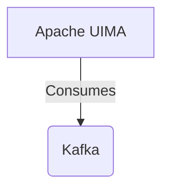

# Connect Kafka to Apache UIMA

Quix helps you integrate Kafka to Apache UIMA using pure Python.

- __Find out how we can help you integrate!__

    <a class="md-button md-button--primary" href="https://share.hsforms.com/1iW0TmZzKQMChk0lxd_tGiw4yjw2?__hstc=175542013.2303933fbd746c0ac86d9ccbe9bc9100.1728383268831.1729603416735.1729620918855.31&__hssc=175542013.1.1729620918855&__hsfp=2132701734" target="_blank" style="margin:.5rem;">Book a demo</a>

## Apache UIMA

Apache UIMA (Unstructured Information Management Architecture) is a software framework used for analyzing large volumes of unstructured information. It enables users to develop applications that can efficiently process and extract relevant information from text, audio, or video content. Apache UIMA uses a pipeline architecture, where different components called annotators are connected together to process the input data and produce meaningful output. These annotators can perform tasks such as named entity recognition, sentiment analysis, and topic detection. Apache UIMA is highly customizable and supports a wide range of programming languages, making it a versatile tool for text mining and natural language processing applications.

## Integrations

Quix is a good fit for integrating with Apache UIMA because it offers a range of features that complement the capabilities of UIMA for processing and analyzing unstructured data. 

Firstly, Quix Cloud provides streamlined development and deployment tools that simplify the creation and deployment of data pipelines, which can be seamlessly integrated with UIMA components. This makes it easier for developers to build and deploy complex data processing workflows that leverage the capabilities of UIMA for natural language processing and text analysis.

Secondly, the enhanced collaboration features of Quix Cloud enable teams to efficiently work together on projects, making it easier to manage and scale UIMA-based data pipelines. With features like organization and permission management, developers can easily collaborate on UIMA workflows and ensure project visibility and control.

Additionally, the real-time monitoring and scaling capabilities of Quix Cloud are crucial for handling the large volumes of unstructured data that UIMA is designed to process. The platform provides tools for real-time logs, metrics, and data exploration, allowing users to monitor pipeline performance and scale resources as needed to handle the high volume of data processed by UIMA.

Overall, the combination of Quix's development, collaboration, monitoring, and scaling capabilities with UIMA's advanced text analysis and natural language processing functionalities make it a well-suited platform for building and managing sophisticated data processing pipelines. Integrating Quix with UIMA can help organizations streamline their text analysis workflows and leverage the power of Apache UIMA for processing unstructured data effectively.

