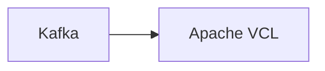

# Connect Kafka to Apache VCL

Quix helps you integrate Kafka to Apache VCL using pure Python.

## Apache VCL

Apache VCL, also known as the Virtual Computing Lab, is an open-source software platform that allows users to remotely access and control virtual machines. This technology enables users to access a variety of computing resources, such as applications, desktop environments, and operating systems, from any location with an internet connection. Apache VCL manages the provisioning, scheduling, and release of virtual machines, making it easier for organizations to manage their computing resources efficiently. With its flexible architecture and support for diverse operating systems and virtualization technologies, Apache VCL is a powerful tool for delivering virtualized computing services to users in a secure and scalable manner.

## Integrations

Quix is a good fit for integrating with Apache VCL because it provides a comprehensive platform for developing, deploying, and managing real-time data pipelines. 

Quix Cloud offers streamlined development and deployment processes, enhancing collaboration through efficient organization and permission management. It also provides real-time monitoring and scaling capabilities, allowing users to easily scale resources and manage CPU and memory efficiently. 

With Quix Streams specifically tailored for processing data in Kafka using Python, integration with Apache VCL would enable users to leverage Kafka's scalability along with a user-friendly Python interface. This integration would allow for seamless processing of data in real-time, supporting various serialization formats, stateful operations, time window aggregations, and resilient scaling using container orchestration.

Overall, the integration of Quix with Apache VCL would provide a powerful solution for organizations looking to develop and manage real-time data pipelines efficiently and effectively.

